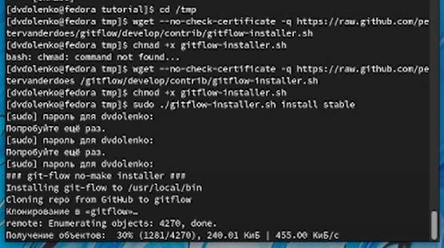
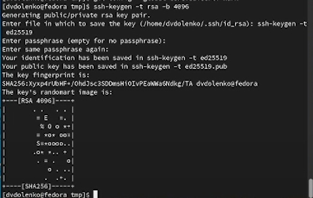
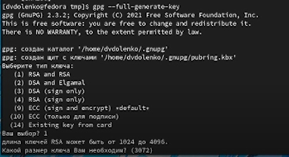
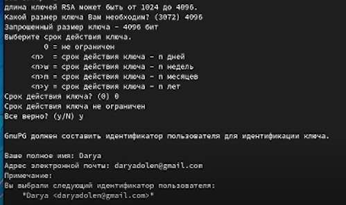
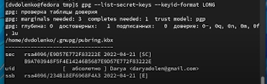
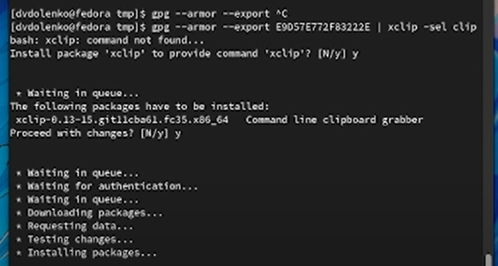
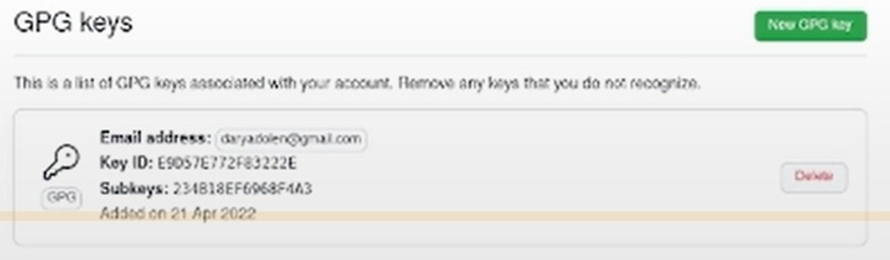
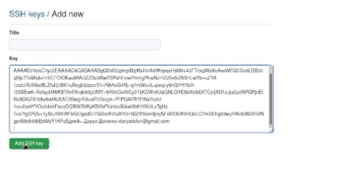

---
## Front matter
lang: ru-RU
title: Markdown
author: |
	  Доленко Дарья Васильевна НБИбд-01-21\inst{1}

institute: |
	\inst{1}Российский Университет Дружбы Народов

date: 25 апреля, 2022, Москва, Россия

## Formatting
mainfont: PT Serif
romanfont: PT Serif
sansfont: PT Sans
monofont: PT Mono
toc: false
slide_level: 2
theme: metropolis
header-includes: 
 - \metroset{progressbar=frametitle,sectionpage=progressbar,numbering=fraction}
 - '\makeatletter'
 - '\beamer@ignorenonframefalse'
 - '\makeatother'
aspectratio: 43
section-titles: true

---

# Цели и задачи работы

## Цель лабораторной работы

Целью данной работы является изучение идеологии и применения средств контроля версий и освоение умений работать с git.

# Процесс выполнения лабораторной работы

## Настраиваю github - создаю учетную запись на сайте.

Регистрация на сайте не прогрузилась на компьютере: я произвела её с телефона. 

Устанавливаю git-flow в Fedora Linux: это программное обеспечение удалено из репозитория, необходимо устанавоивать его вручную с помощью команд:

## Устанавливаю gh в Fedora Linux:

## Произвожу базовую настройку git:

## По алгоритму rsa создаю ключи ssh:

## Генерирую ключ pgp:

## 

## Добавляю ключ pgp в github:

## 

## 

## 

## Добавляю ключ ssh в github аналогичным образом:

## 

## Настраиваю автоматические подписи коммитов git:

## Настраиваю gh:

## Создаю репозиторий на основе рабочего пространства:

# Выводы по проделанной работе

## Вывод

Вывод: в ходе выполнения лабораторной работы я изучила идеологию и применение средств контроля версий, а также освоила умние по работе с git.
