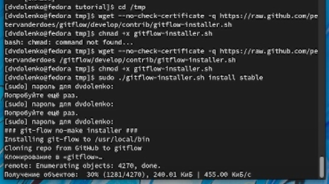
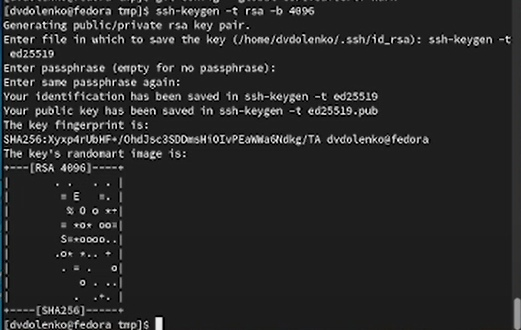
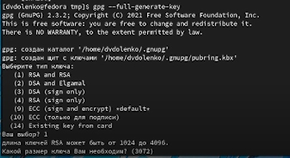
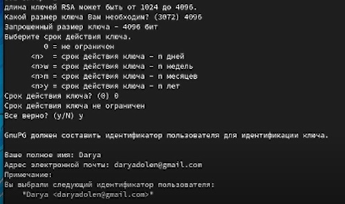
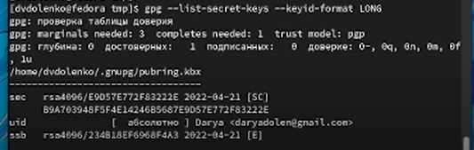
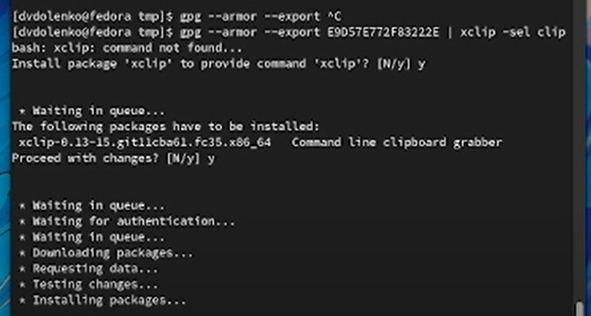
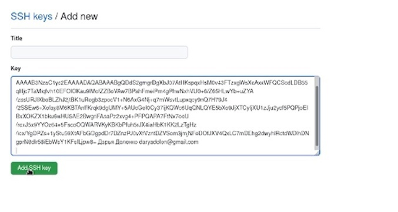
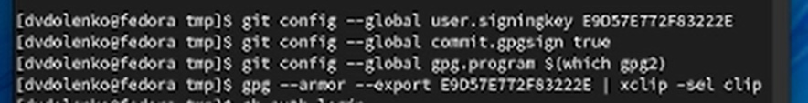
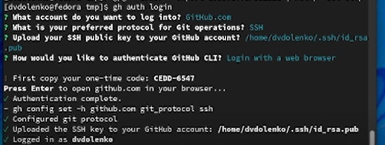

---
## Front matter
title: "Лабораторная работа-03"
subtitle: "Markdown"
author: "Доленко Дарья Васильевная НБИбд-01-21"

## Generic otions
lang: ru-RU
toc-title: "Содержание"

## Bibliography
bibliography: bib/cite.bib
csl: pandoc/csl/gost-r-7-0-5-2008-numeric.csl

## Pdf output format
toc: true # Table of contents
toc-depth: 2
lof: true # List of figures
lot: true # List of tables
fontsize: 12pt
linestretch: 1.5
papersize: a4
documentclass: scrreprt
## I18n polyglossia
polyglossia-lang:
  name: russian
  options:
	- spelling=modern
	- babelshorthands=true
polyglossia-otherlangs:
  name: english
## I18n babel
babel-lang: russian
babel-otherlangs: english
## Fonts
mainfont: PT Serif
romanfont: PT Serif
sansfont: PT Sans
monofont: PT Mono
mainfontoptions: Ligatures=TeX
romanfontoptions: Ligatures=TeX
sansfontoptions: Ligatures=TeX,Scale=MatchLowercase
monofontoptions: Scale=MatchLowercase,Scale=0.9
## Biblatex
biblatex: true
biblio-style: "gost-numeric"
biblatexoptions:
  - parentracker=true
  - backend=biber
  - hyperref=auto
  - language=auto
  - autolang=other*
  - citestyle=gost-numeric
## Pandoc-crossref LaTeX customization
figureTitle: "Рис."
tableTitle: "Таблица"
listingTitle: "Листинг"
lofTitle: "Список иллюстраций"
lotTitle: "Список таблиц"
lolTitle: "Листинги"
## Misc options
indent: true
header-includes:
  - \usepackage{indentfirst}
  - \usepackage{float} # keep figures where there are in the text
  - \floatplacement{figure}{H} # keep figures where there are in the text
---

# Цель работы

Целью данной работы является изучение идеологии и применения средств контроля версий и освоение умений работать с git.

# Выполнение лабораторной работы

Настраиваю github - создаю учетную запись на сайте.
Регистрация на сайте не прогрузилась на компьютере: я произвела её с телефона. 

Устанавливаю git-glow в Fedora Linux: это программное обеспечение удалено из репозитория, необходимо устанавоивать его вручную с помощью команд: (рис. [-@fig:001])

{#fig:001 width=70%}

Устанавливаю gh в Fedora Linux: (рис. [-@fig:002])

{#fig:002 width=70%}

Произвожу базовую настройку git: (рис. [-@fig:003])

{#fig:003 width=70%}

По алгоритму rsa создаю ключи ssh: (рис. [-@fig:004])

{#fig:004 width=70%}

Генерирую ключ pgp: (рис. [-@fig:005; -@fig:006]).

{#fig:005 width=70%}

{#fig:006 width=70%}

Добавляю ключ pgp в github: (рис. [-@fig:007] [-@fig:008] [-@fig:009] [-@fig:010]).

{#fig:007 width=70%}

{#fig:008 width=70%}

{#fig:009 width=70%}

{#fig:010 width=70%}

Добавляю ключ ssh в github аналогичным образом: (рис. [-@fig:011] [-@fig:012]).

{#fig:011 width=70%}

{#fig:012 width=70%}

Настраиваю автоматические подписи коммитов git: (рис. [-@fig:013]).

{#fig:013 width=70%}

Настраиваю gh: (рис. [-@fig:014]).

{#fig:014 width=70%}

Создаю репозиторий на основе рабочего пространства: (рис. [-@fig:015]).

{#fig:015 width=70%}

# Вывод

Вывод: в ходе выполнения лабораторной работы я изучила идеологию и применение средств контроля версий, а также освоила умние по работе с git.

# Контрольные вопросы

Ответы на контрольные вопросы лабораторной работы №2 находятся в отчете к абораторной работе №2 в рамках выполнения той работы.

# Список литературы{.unnumbered}

::: {#refs}
:::

1. [Лекция Системы контроля версий] (http://uii.mpei.ru/study/courses/sdt/16/lecture02.2_vcs.slides.pdf)
2. ССылка на литературу [@lit01]

