---
## Front matter
lang: ru-RU
title: Markdown
author: |
	  Доленко Дарья Васильевна НБИбд-01-21\inst{1}

institute: |
	\inst{1}Российский Университет Дружбы Народов

date: 25 апреля, 2022, Москва, Россия

## Formatting
mainfont: PT Serif
romanfont: PT Serif
sansfont: PT Sans
monofont: PT Mono
toc: false
slide_level: 2
theme: metropolis
header-includes: 
 - \metroset{progressbar=frametitle,sectionpage=progressbar,numbering=fraction}
 - '\makeatletter'
 - '\beamer@ignorenonframefalse'
 - '\makeatother'
aspectratio: 43
section-titles: true

---

# Цели и задачи работы

## Цель лабораторной работы

Ознакомление с файловой системой Linux, её структурой, именами и содержанием каталогов. Приобретение практических навыков по применению команд для работы с файлоами и каталогами, по управлению процессами (и работами), по проверке использования диска и обслуживанию файловой системы.

# Процесс выполнения лабораторной работы

## Настраиваю github - создаю учетную запись на сайте.

# Выполняю примеры, приведенные в первой части лабораторной работы:

## Копирую файл в текущем каталоге: копирую файл ~/abc1 в файл april и в файл may. (рис. [-@fig:001])

{#fig:001 width=70%}

## Копирую несколько каталогов в каталог: копирую файлы april, may в каталог monthly. (рис. [-@fig:002])

{#fig:002 width=70%}

## Копирую файлы в произвольном каталоге: копирую файл monthly/may в файл с именем june: рис. [-@fig:003])

{#fig:003 width=70%}

## Копирую каталог monthly в каталог monthly.00. (рис. [-@fig:004])

{#fig:004 width=70%}

## Копирую каталог monthly.00 в каталог /tmp.  (рис. [-@fig:005])

{#fig:005 width=70%}

## Изменяю название файла april на july в домашнем каталоге:  (рис. [-@fig:006])

{#fig:006 width=70%}

## Перемещаю файл july в каталог monthly.00.  (рис. [-@fig:007])

{#fig:007 width=70%}

## Переименовываю каталог monthly.00 в monthly.01.  (рис. [-@fig:008])

{#fig:008 width=70%}

## Перемещаю каталог monthly.01 в каталог reports.  (рис. [-@fig:009])

{#fig:009 width=70%}

## Переименовываю каталог reports/monthly.01 в reports/monthly.  (рис. [-@fig:010])

{#fig:010 width=70%}

## Создаю файл ~/may с правом выполнения для владельца.  (рис. [-@fig:011])

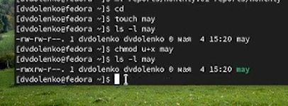{#fig:011 width=70%}

## Лишаю владельца прав на выполнение. (рис. [-@fig:012])

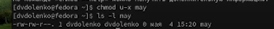{#fig:012 width=70%}

## Создаю каталог с запретом на чтение для членов группы и всех остальных пользователей. (рис. [-@fig:013])

{#fig:013 width=70%}

## Создаю каталог с правом записи для членов группы. (рис. [-@fig:014])

{#fig:014 width=70%}

## Проверяю целостность файловой системы. (рис. [-@fig:015])

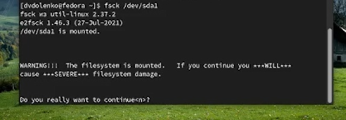{#fig:015 width=70%}

# Приступаю к выполнению основной часть лабораторной работы (используемые команды и их результаты указаны в скриншотах:

## Копирую файл в домашний каталог и даю ему определенной название. (рис. [-@fig:016])

{#fig:016 width=70%}

## В домашнем каталоге создаю указанную директорию. (рис. [-@fig:017])

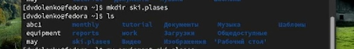{#fig:017 width=70%}

## Перемещаю созданный файл в каталог. (рис. [-@fig:018])

{#fig:018 width=70%}

## Переименовываю файл в каталоге из домашней директории. (рис. [-@fig:019])

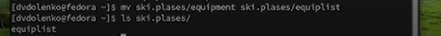{#fig:019 width=70%}

## Создаю в домашнем каталоге файл, копирую его в каталог и меняю его название. (рис. [-@fig:020])

{#fig:020 width=70%}

## Создаю каталог в каталоге. (рис. [-@fig:021])

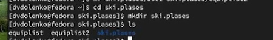{#fig:021 width=70%}

## Перемещаю файлы в каталог. (рис. [-@fig:022])

{#fig:022 width=70%}

## Создаю и перемещаю каталог в каталог, переназываю его. (рис. [-@fig:023])

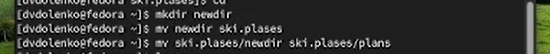{#fig:023 width=70%}

## Определяю опции команды chmod, ннеобходимый для того, чтобы присвоить перечисленным в лабораторной работе файлам определенные права доступа.(рис. [-@fig:024] [-@fig:025] [-@fig:026] [-@fig:027] [-@fig:028] [-@fig:029] [-@fig:030] [-@fig:031])

{#fig:024 width=70%}

##

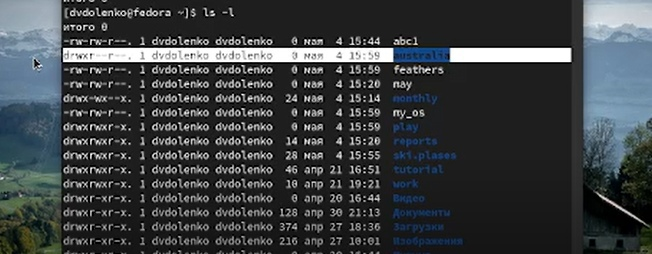{#fig:025 width=70%}

##

{#fig:026 width=70%}

##

{#fig:027 width=70%}

##

{#fig:028 width=70%}

##

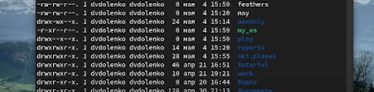{#fig:029 width=70%}

##

{#fig:030 width=70%}

##

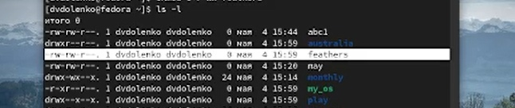{#fig:031 width=70%}

## Просматриваю содержимое файла.(рис. [-@fig:032])

{#fig:032 width=70%}

## Копирую файл в файл. Перемещаю файл в каталог. Копирую каталог в каталог.(рис. [-@fig:033])

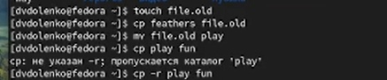{#fig:033 width=70%}

## Перемещаю каталог в каталог и меняю там его название.(рис. [-@fig:034])

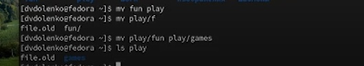{#fig:034 width=70%}

## Лишаю владельца файла прав на чтение. Проверяю, что произойдет при попытке просмотра данного файла командой cat. Проверяю, что произойдет при попытке скопировать данный файл. Даю владельцу данного файла прва на чтение.(рис. [-@fig:035])

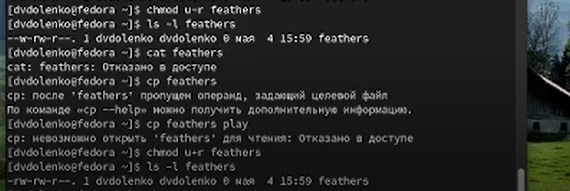{#fig:035 width=70%}

## Лишаю владельца каталога права на выполнение. Проверяю, что произойдет при попытке перейти в данный каталог. Даю владельцу данного каталога право на выполнение.(рис. [-@fig:036])

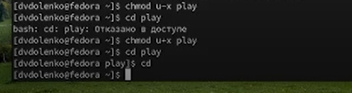{#fig:036 width=70%}

## Читаю man по командам mount, fsck, mkfs, kill. (рис. [-@fig:037] [-@fig:038] [-@fig:039])

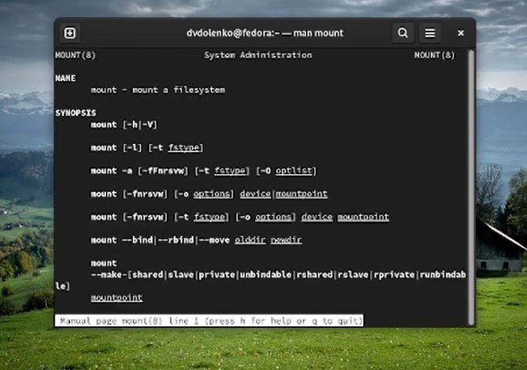{#fig:037 width=70%}

##

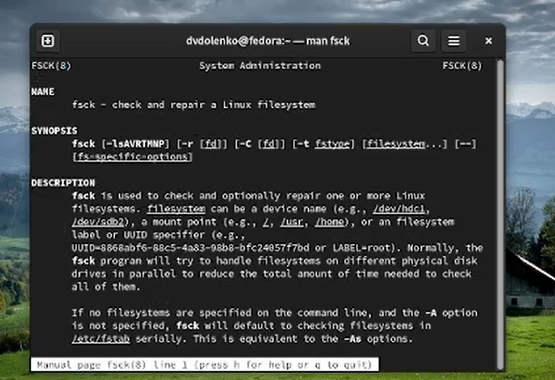{#fig:038 width=70%}

##

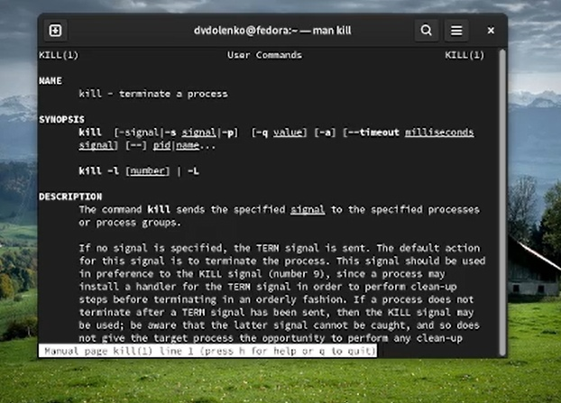{#fig:039 width=70%}

## Краткая характеристика: mount применяется для монтирования файловых систем; fsck восстанавливает повреждённую файловую систему или проверяет на целостность; mkfs создаёт новую файловую систему; kill используется для принудительного завершения работы приложений.

# Выводы по проделанной работе

## Вывод

Вывод: В ходе данной лабораторной работы я ознакомилась с файловой системой Linux, её структурой, именами и содержанием каталогов; приобрела практические навыки по применению команд для работы с файлоами и каталогами, по управлению процессами (и работами), по проверке использования диска и обслуживанию файловой системы.
