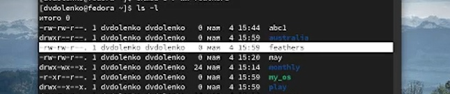
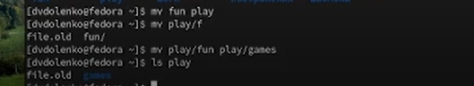
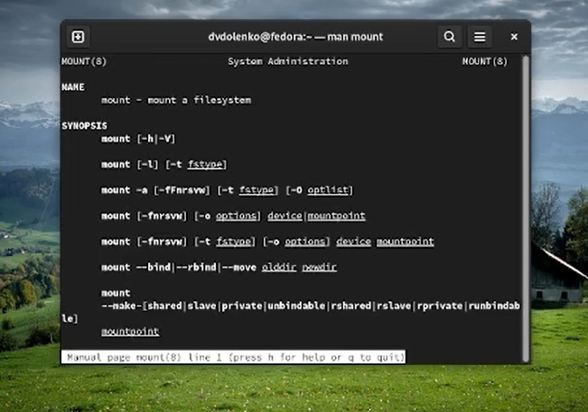
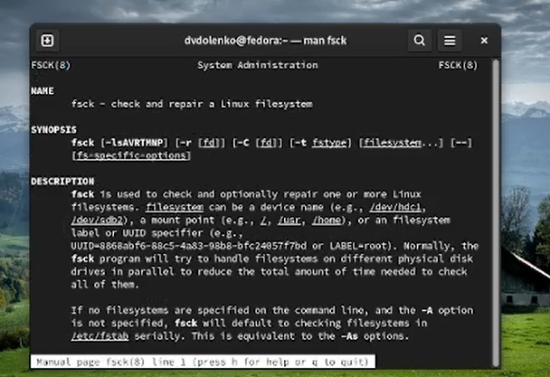
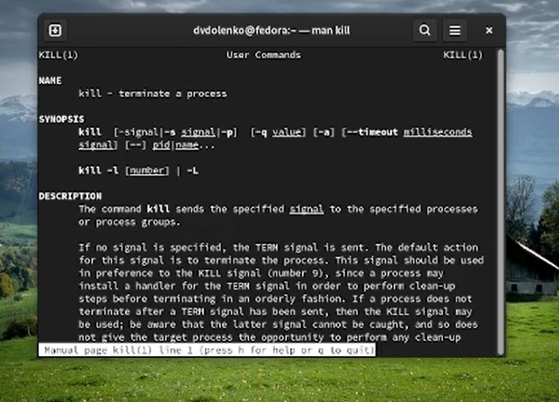

---
## Front matter
title: "Лабораторная работа-05"
subtitle: "Markdown"
author: "Доленко Дарья Васильевная НБИбд-01-21"

## Generic otions
lang: ru-RU
toc-title: "Содержание"

## Bibliography
bibliography: bib/cite.bib
csl: pandoc/csl/gost-r-7-0-5-2008-numeric.csl

## Pdf output format
toc: true # Table of contents
toc-depth: 2
lof: true # List of figures
lot: true # List of tables
fontsize: 12pt
linestretch: 1.5
papersize: a4
documentclass: scrreprt
## I18n polyglossia
polyglossia-lang:
  name: russian
  options:
	- spelling=modern
	- babelshorthands=true
polyglossia-otherlangs:
  name: english
## I18n babel
babel-lang: russian
babel-otherlangs: english
## Fonts
mainfont: PT Serif
romanfont: PT Serif
sansfont: PT Sans
monofont: PT Mono
mainfontoptions: Ligatures=TeX
romanfontoptions: Ligatures=TeX
sansfontoptions: Ligatures=TeX,Scale=MatchLowercase
monofontoptions: Scale=MatchLowercase,Scale=0.9
## Biblatex
biblatex: true
biblio-style: "gost-numeric"
biblatexoptions:
  - parentracker=true
  - backend=biber
  - hyperref=auto
  - language=auto
  - autolang=other*
  - citestyle=gost-numeric
## Pandoc-crossref LaTeX customization
figureTitle: "Рис."
tableTitle: "Таблица"
listingTitle: "Листинг"
lofTitle: "Список иллюстраций"
lotTitle: "Список таблиц"
lolTitle: "Листинги"
## Misc options
indent: true
header-includes:
  - \usepackage{indentfirst}
  - \usepackage{float} # keep figures where there are in the text
  - \floatplacement{figure}{H} # keep figures where there are in the text
---

# Цель работы

Ознакомление с файловой системой Linux, её структурой, именами и содержанием каталогов. Приобретение практических навыков по применению команд для работы с файлоами и каталогами, по управлению процессами (и работами), по проверке использования диска и обслуживанию файловой системы.

# Выполнение лабораторной работы

Выполняю примеры, приведенные в первой части лабораторной работы:

Копирую файл в текущем каталоге: копирую файл ~/abc1 в файл april и в файл may. (рис. [-@fig:001])

{#fig:001 width=70%}

Копирую несколько каталогов в каталог: копирую файлы april, may в каталог monthly. (рис. [-@fig:002])

{#fig:002 width=70%}

Копирую файлы в произвольном каталоге: копирую файл monthly/may в файл с именем june: рис. [-@fig:003])

{#fig:003 width=70%}

Копирую каталог monthly в каталог monthly.00. (рис. [-@fig:004])

{#fig:004 width=70%}

Копирую каталог monthly.00 в каталог /tmp.  (рис. [-@fig:005])

{#fig:005 width=70%}

Изменяю название файла april на july в домашнем каталоге:  (рис. [-@fig:006])

{#fig:006 width=70%}

Перемещаю файл july в каталог monthly.00.  (рис. [-@fig:007])

{#fig:007 width=70%}

Переименовываю каталог monthly.00 в monthly.01.  (рис. [-@fig:008])

{#fig:008 width=70%}

Перемещаю каталог monthly.01 в каталог reports.  (рис. [-@fig:009])

{#fig:009 width=70%}

Переименовываю каталог reports/monthly.01 в reports/monthly.  (рис. [-@fig:010])

{#fig:010 width=70%}

Создаю файл ~/may с правом выполнения для владельца.  (рис. [-@fig:011])

{#fig:011 width=70%}

Лишаю владельца прав на выполнение. (рис. [-@fig:012])

{#fig:012 width=70%}

Создаю каталог с запретом на чтение для членов группы и всех остальных пользователей. (рис. [-@fig:013])

{#fig:013 width=70%}

Создаю каталог с правом записи для членов группы. (рис. [-@fig:014])

{#fig:014 width=70%}

Проверяю целостность файловой системы. (рис. [-@fig:015])

{#fig:015 width=70%}

Приступаю к выполнению основной часть лабораторной работы (используемые команды и их результаты указаны в скриншотах:

Копирую файл в домашний каталог и даю ему определенной название. (рис. [-@fig:016])

{#fig:016 width=70%}

В домашнем каталоге создаю указанную директорию. (рис. [-@fig:017])

{#fig:017 width=70%}

Перемещаю созданный файл в каталог. (рис. [-@fig:018])

{#fig:018 width=70%}

Переименовываю файл в каталоге из домашней директории. (рис. [-@fig:019])

{#fig:019 width=70%}

Создаю в домашнем каталоге файл, копирую его в каталог и меняю его название. (рис. [-@fig:020])

{#fig:020 width=70%}

Создаю каталог в каталоге. (рис. [-@fig:021])

{#fig:021 width=70%}

Перемещаю файлы в каталог. (рис. [-@fig:022])

{#fig:022 width=70%}

Создаю и перемещаю каталог в каталог, переназываю его. (рис. [-@fig:023])

{#fig:023 width=70%}

Определяю опции команды chmod, ннеобходимый для того, чтобы присвоить перечисленным в лабораторной работе файлам определенные права доступа.(рис. [-@fig:024] [-@fig:025] [-@fig:026] [-@fig:027] [-@fig:028] [-@fig:029] [-@fig:030] [-@fig:031])

{#fig:024 width=70%}

{#fig:025 width=70%}

{#fig:026 width=70%}

{#fig:027 width=70%}

{#fig:028 width=70%}

{#fig:029 width=70%}

{#fig:030 width=70%}

{#fig:031 width=70%}

Просматриваю содержимое файла.(рис. [-@fig:032])

{#fig:032 width=70%}

Копирую файл в файл. Перемещаю файл в каталог. Копирую каталог в каталог.(рис. [-@fig:033])

{#fig:033 width=70%}

Перемещаю каталог в каталог и меняю там его название.(рис. [-@fig:034])

{#fig:034 width=70%}

Лишаю владельца файла прав на чтение. Проверяю, что произойдет при попытке просмотра данного файла командой cat. Проверяю, что произойдет при попытке скопировать данный файл. Даю владельцу данного файла прва на чтение.(рис. [-@fig:035])

{#fig:035 width=70%}

Лишаю владельца каталога права на выполнение. Проверяю, что произойдет при попытке перейти в данный каталог. Даю владельцу данного каталога право на выполнение.(рис. [-@fig:036])

{#fig:036 width=70%}

Читаю man по командам mount, fsck, mkfs, kill. (рис. [-@fig:037] [-@fig:038] [-@fig:039])

{#fig:037 width=70%}

{#fig:038 width=70%}

{#fig:039 width=70%}

Краткая характеристика: mount применяется для монтирования файловых систем; fsck восстанавливает повреждённую файловую систему или проверяет на целостность; mkfs создаёт новую файловую систему; kill используется для принудительного завершения работы приложений.

# Вывод

Вывод: В ходе данной лабораторной работы я ознакомилась с файловой системой Linux, её структурой, именами и содержанием каталогов; приобрела практические навыки по применению команд для работы с файлоами и каталогами, по управлению процессами (и работами), по проверке использования диска и обслуживанию файловой системы.

# Контрольные вопросы

1. Характеристика файловой системы, которая использовалась в данной лабораторной работе: Файлы: abc1, april, may, june, july, isdv4.h, equipment, equiplist, equiplist2, my_os, feathers, file.old. Каталоги: monthly, monthly.00, tmp, monthly.01, reports, usr, ski.plases, equipment, newdir, plans, australia, play, etc, fun, games.

2. Пример общей структуры файловой системы: /home/pdarzhankina/monthly/april, где /home/pdarzhankina – домашний каталог, /monthly – каталог, находящийся в домашнем и содержащий файл, /аpril – файл, находящийся в каталоге.

3. Чтобы содержимое некоторой файловой системы было доступно операционной системе должно быть выполнено монтирование тома.

4. Основные причины нарушения целостности файловой системы:

    Один блок адресуется несколькими mode (принадлежит нескольким файлам).
    Блок помечен как свободный, но в то же время занят (на него ссылается onode).
    Блок помечен как занятый, но в то же время свободен (ни один inode на него не ссылается).
    Неправильное число ссылок в inode (недостаток или избыток ссылающихся записей в каталогах).
    Несовпадение между размером файла и суммарным размером адресуемых inode блоков.
    Недопустимые адресуемые блоки (например, расположенные за пределами файловой системы).
    "Потерянные" файлы (правильные inode, на которые не ссылаются записи каталогов).
    Недопустимые или неразмещенные номера inode в записях каталогов. Чтобы устранить повреждения файловой системы используется команда fsck.

5. Команда mkfs создаёт новую файловую систему.

6. Характеристика команд, которые позволяют просмотреть текстовые файлы:

    для просмотра небольших файлов удобно пользоваться командой cat.
    для просмотра больших файлов используйте команду less — она позволяет осуществлять постраничный просмотр файлов.
    для просмотра начала файла можно воспользоваться командой head, по умолчанию она выводит первые 10 строк файла.
    команда tail выводит несколько (по умолчанию 10) последних строк файла.

7. Основные возможности команды cp:

    копирование файла в текущем каталоге.
    копирование нескольких файлов в каталог.
    копирование файлов в произвольном каталоге. Опция i в команде cp выведет на экран запрос подтверждения о перезаписи файла, если на место целевого файла вы поставите имя уже существующего файла. Команда cp с опцией r (recursive) позволяет копировать каталоги вместе с входящими в них файлами и каталогами.

8. Характеристика команд перемещения и переименования файлов и каталогов:

    переименование файлов в текущем каталоге. mv <старое_название_файла> <новое_название_файла>
    перемещение файлов в другой каталог. mv <название_файла> <название_каталога> Если необходим запрос подтверждения о перезаписи файла, то нужно использовать опцию i.
    переименование каталогов в текущем каталоге. mv <старое_название_каталога> <новое_название_каталога>
    перемещение каталога в другой каталог. mv <старый_каталога> <новый_каталог>
    переименование каталога, не являющегося текущим. mv <каталог/старое_название_каталога> < каталог/новое_название_каталога>

9. Каждый файл или каталог имеет права доступа: чтение (разрешены просмотр и копирование файла, разрешён просмотр списка входящих в каталог файлов), запись (разрешены изменение и переименование файла, разрешены создание и удаление файлов каталога), выполнение (разрешено выполнение файла, разрешён доступ в каталог и есть возможность сделать его текущим). Они могу быть изменены командой chmod.

# Список литературы{.unnumbered}

::: {#refs}
:::

1. [Лекция Системы контроля версий] (http://uii.mpei.ru/study/courses/sdt/16/lecture02.2_vcs.slides.pdf)
2. ССылка на литературу [@lit01]

