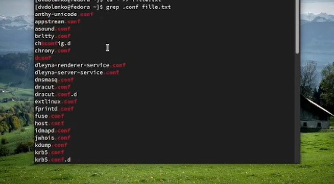
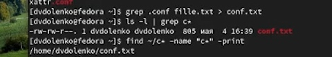
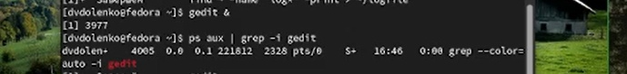
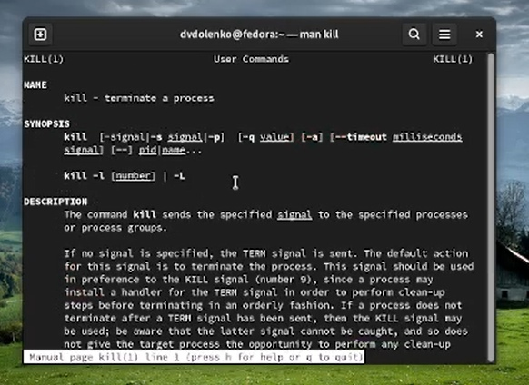
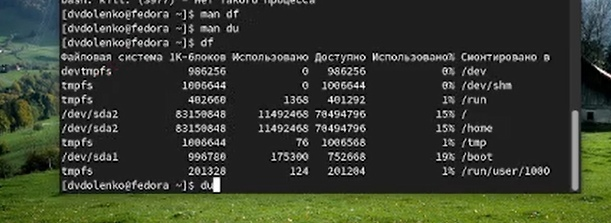

---
## Front matter
lang: ru-RU
title: Поиск файлов. Перенаправление ввода-вывода. Просмотр запущенных процессов
author: |
	  Доленко Дарья Васильевна НБИбд-01-21\inst{1}

institute: |
	\inst{1}Российский Университет Дружбы Народов

date: 25 апреля, 2022, Москва, Россия

## Formatting
mainfont: PT Serif
romanfont: PT Serif
sansfont: PT Sans
monofont: PT Mono
toc: false
slide_level: 2
theme: metropolis
header-includes: 
 - \metroset{progressbar=frametitle,sectionpage=progressbar,numbering=fraction}
 - '\makeatletter'
 - '\beamer@ignorenonframefalse'
 - '\makeatother'
aspectratio: 43
section-titles: true

---

# Цели и задачи работы

## Цель лабораторной работы

Ознакомление с инструментами поиска файлов и фильтрации текстовых данных.
Приобретение практических навыков: по управлению процессами (и заданиями), по
проверке использования диска и обслуживанию файловых систем.

# Процесс выполнения лабораторной работы

## Осуществляю вход в систему, используя соответствующее имя пользователя.  (рис. [-@fig:001])

{#fig:001 width=70%}

## Записывааю в файл file.txt названия файлов, содержащихся в каталоге /etc. Дописываю в этот же файл названия файлов, содержащихся в моем домашнем каталоге.(рис. [-@fig:002])

{#fig:002 width=70%}

## Вывожу имена всех файлов из file.txt,имеющих расширение .conf,после чего записываю их в новый текстовой файл conf.txt.(рис. [-@fig:003])

{#fig:003 width=70%}

## Определяю, какие файлы в моем домашнем каталоге имеют имена, начинавшиеся
с символа c. Демонстрирую несколько вариантов.(рис. [-@fig:004])

{#fig:004 width=70%}

## Вывожу на экран (по странично) имена файлов из каталога /etc,начинающиеся с символа h. (рис. [-@fig:005])

{#fig:005 width=70%}

## Запускаю в фоновом режиме процесс,который будет записывать в файл ~/logfile файлы,имена которых начинаются с log. Удаляю файл ~/logfile. (рис. [-@fig:006])

{#fig:006 width=70%}

## Запускаю из консоли в фоновом режиме редактор gedit. Определяю идентификатор процесса gedit, используя командуps, конвейер и фильтр grep. (рис. [-@fig:007])

{#fig:007 width=70%}

## Читаю справку команды kill, после чего использую её для завершения процесса gedit. (рис. [-@fig:008] [-@fig:009])

{#fig:008 width=70%}

##

{#fig:009 width=70%}

## Выполняю команды df и du,предварительно получив более подробную информацию об этих командах, с помощью команды man. (рис. [-@fig:010])

{#fig:010 width=70%}

## Воспользовавшись справкой команды find, вывожу имена всех директорий, имеющихся в моем домашнем каталоге. (рис. [-@fig:011])

{#fig:011 width=70%}

# Выводы по проделанной работе

## Вывод

В ходе данной лабораторной работы я ознакомилась с инструментами поиска файлов и фильтрации текстовых данных, приобрела практические навыки: по управлению процессами (и заданиями), по
проверке использования диска и обслуживанию файловых систем.
