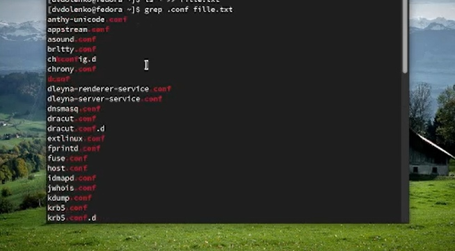
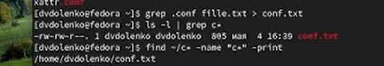
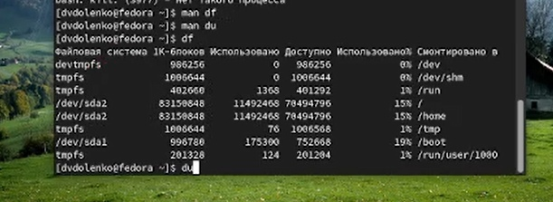

---
## Front matter
title: "Лабораторная работа-06"
subtitle: "Поиск файлов. Перенаправление
ввода-вывода. Просмотр запущенных процессов"
author: "Доленко Дарья Васильевная НБИбд-01-21"

## Generic otions
lang: ru-RU
toc-title: "Содержание"

## Bibliography
bibliography: bib/cite.bib
csl: pandoc/csl/gost-r-7-0-5-2008-numeric.csl

## Pdf output format
toc: true # Table of contents
toc-depth: 2
lof: true # List of figures
lot: true # List of tables
fontsize: 12pt
linestretch: 1.5
papersize: a4
documentclass: scrreprt
## I18n polyglossia
polyglossia-lang:
  name: russian
  options:
	- spelling=modern
	- babelshorthands=true
polyglossia-otherlangs:
  name: english
## I18n babel
babel-lang: russian
babel-otherlangs: english
## Fonts
mainfont: PT Serif
romanfont: PT Serif
sansfont: PT Sans
monofont: PT Mono
mainfontoptions: Ligatures=TeX
romanfontoptions: Ligatures=TeX
sansfontoptions: Ligatures=TeX,Scale=MatchLowercase
monofontoptions: Scale=MatchLowercase,Scale=0.9
## Biblatex
biblatex: true
biblio-style: "gost-numeric"
biblatexoptions:
  - parentracker=true
  - backend=biber
  - hyperref=auto
  - language=auto
  - autolang=other*
  - citestyle=gost-numeric
## Pandoc-crossref LaTeX customization
figureTitle: "Рис."
tableTitle: "Таблица"
listingTitle: "Листинг"
lofTitle: "Список иллюстраций"
lotTitle: "Список таблиц"
lolTitle: "Листинги"
## Misc options
indent: true
header-includes:
  - \usepackage{indentfirst}
  - \usepackage{float} # keep figures where there are in the text
  - \floatplacement{figure}{H} # keep figures where there are in the text
---

# Цель работы

Ознакомление с инструментами поиска файлов и фильтрации текстовых данных.
Приобретение практических навыков: по управлению процессами (и заданиями), по
проверке использования диска и обслуживанию файловых систем.

# Выполнение лабораторной работы

Осуществляю вход в систему, используя соответствующее имя пользователя.  (рис. [-@fig:001])

{#fig:001 width=70%}

Записывааю в файл file.txt названия файлов, содержащихся в каталоге /etc. Дописываю в этот же файл названия файлов, содержащихся в моем домашнем каталоге.(рис. [-@fig:002])

{#fig:002 width=70%}

Вывожу имена всех файлов из file.txt,имеющих расширение .conf,после чего записываю их в новый текстовой файл conf.txt.(рис. [-@fig:003])

{#fig:003 width=70%}

Определяю, какие файлы в моем домашнем каталоге имеют имена, начинавшиеся
с символа c. Демонстрирую несколько вариантов.(рис. [-@fig:004])

{#fig:004 width=70%}

Вывожу на экран (по странично) имена файлов из каталога /etc,начинающиеся с символа h. (рис. [-@fig:005])

{#fig:005 width=70%}

Запускаю в фоновом режиме процесс,который будет записывать в файл ~/logfile файлы,имена которых начинаются с log. Удаляю файл ~/logfile. (рис. [-@fig:006])

{#fig:006 width=70%}

Запускаю из консоли в фоновом режиме редактор gedit. Определяю идентификатор процесса gedit, используя командуps, конвейер и фильтр grep. (рис. [-@fig:007])

{#fig:007 width=70%}

Читаю справку команды kill, после чего использую её для завершения процесса gedit. (рис. [-@fig:008] [-@fig:009])

{#fig:008 width=70%}

{#fig:009 width=70%}

Выполняю команды df и du,предварительно получив более подробную информацию об этих командах, с помощью команды man. (рис. [-@fig:010])

{#fig:010 width=70%}

Воспользовавшись справкой команды find, вывожу имена всех директорий, имеющихся в моем домашнем каталоге. (рис. [-@fig:011])

{#fig:011 width=70%}

# Вывод

Вывод: в ходе данной лабораторной работы я ознакомилась с инструментами поиска файлов и фильтрации текстовых данных, приобрела практические навыки: по управлению процессами (и заданиями), по
проверке использования диска и обслуживанию файловых систем.

# Контрольные вопросы

    Какие потоки ввода вывода вы знаете?

    Объясните разницу между операцией > и >>.

    Чтотакое конвейер?

    Чтотакое процесс? Чем это понятие отличается от программы?

    Чтот акое PID и GID?

    Чтотакое задачи и какая команда позволяет ими управлять?

    Найдите информацию об утилитах top и htop.Каковы их функции?

    Назовите и дайте характеристику команде поиска файлов.Приведите примеры ис- пользования этой команды.

    Можно ли по контексту (содержанию) найти файл? Если да,то как?

    Как определить объем свободной памяти на жёстком диске?

    Как определить объем вашего домашнего каталога?

    Как удалить зависший процесс?

Отвeты на вопросы:

1. В системе по умолчанию открыто три специальных потока: – stdin — стандартный поток ввода (по умолчанию: клавиатура), файловый дескриптор 0; – stdout — стандартный поток вывода (по умолчанию: консоль), файловый дескриптор 1; – stderr — стандартный поток вывод сообщений об ошибках (по умолчанию: консоль), файловый дескриптор 2.

2. Перенаправление stdout (вывода) в файл. Если файл отсутствовал, то он создаётся, иначе - перезаписывается.

	перенаправление stdout (вывода) в файл. Если файл отсутствовал, то он создаётся, иначе - добавляется.

3. Конвейер (pipe) служит для объединения простых команд или утилит в цепочки, в которых результат работы предыдущей команды передаётся последующей.

4. Процесс это - совокупность программного кода и данных, загруженных в память ЭВМ. Любой команде, выполняемой в системе, присваивается идентификатор процесса (process ID). Получить информацию о процессе и управлять им, пользуясь идентификатором процесса, можно из любого окна командного интерпретатора. Процессом называют выполняющуюся программу и все её элементы: адресное пространство, глобальные переменные, регистры, стек, открытые файлы и так далее.

5. PID — уникальный номер (идентификатор) процесса в многозадачной ОС. GID – идентификатор группы.

6. Любую выполняющуюся в консоли команду или внешнюю программу можно запустить в фоновом режиме. Запущенные фоном программы называются задачами (jobs). Ими можно управлять с помощью команды jobs, которая выводит список запущенных в данный момент задач. Для завершения задачи необходимо выполнить команду kill %номер задачи.

7. Команда top в Linux системах позволяет вывести в виде таблицы перечень запущенных процессов и оценить, какой объем ресурсов они потребляют, т.е., какую нагрузку создают на сервер и дисковую подсистему. Команда htop — продвинутый монитор процессов, показывает динамический список системных процессов, список обычно выравнивается по использованию ЦПУ. В отличие от top, htop показывает все процессы в системе. Также показывает время непрерывной работы, использование процессоров и памяти. htop часто применяется в тех случаях, когда информации даваемой утилитой top недостаточно, например при поиске утечек памяти в процессах.

8. Команда find используется для поиска и отображения имён файлов, соответствующих заданной строке символов. Формат команды: find путь [-опции] Путь определяет каталог, начиная с которого по всем подкаталогам будет вестись поиск. Примеры:

    вывести на экран имена файлов из вашего домашнего каталога и его подкаталогов, начинающихся на f: find ~ -name "f*" -print
    вывести на экран имена файлов в каталоге /etc, начинающихся с символа p: find /etc -name "p*" -print
    найти в вашем домашнем каталоге файлы, имена которых заканчиваются символом и удалить их: find ~ -name "*~" -exec rm "{}" ;

9. Найти файл по контексту (содержанию) позволяет команда grep. Формат команды: grep строка имя_файла Примеры:

    показать строки во всех файлах в вашем домашнем каталоге с именами, начинающимися на f, в которых есть слово begin: grep begin f*
    найти в текущем каталоге все файлы, в имени которых есть буквосочетание «лаб»: ls -l | grep лаб

10. Определить объем свободной памяти на жёстком диске позволяет команда df.

11. Определить объем домашнего каталога позволяет команда df /home/<user_name>

12. Удалить зависший процесс можно командой kill %номер задачи.

# Список литературы{.unnumbered}

::: {#refs}
:::

1. [Лекция Системы контроля версий] (http://uii.mpei.ru/study/courses/sdt/16/lecture02.2_vcs.slides.pdf)
2. ССылка на литературу [@lit01]

