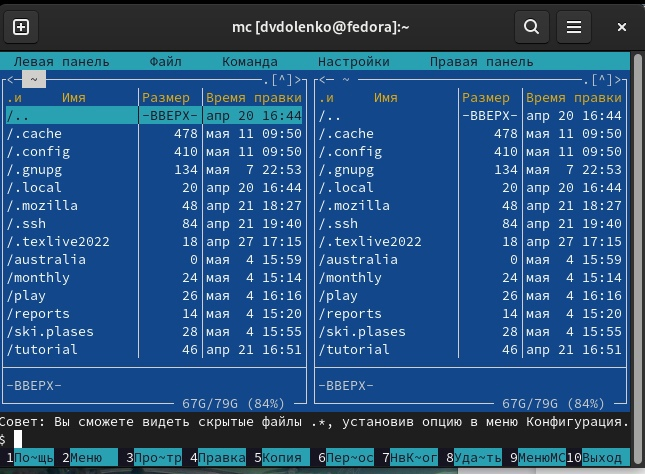
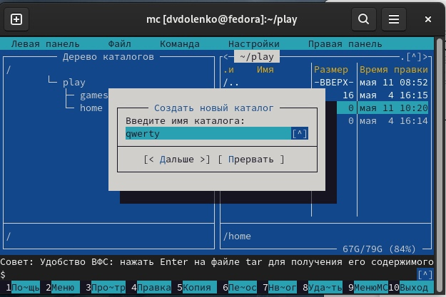
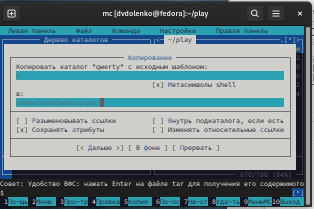
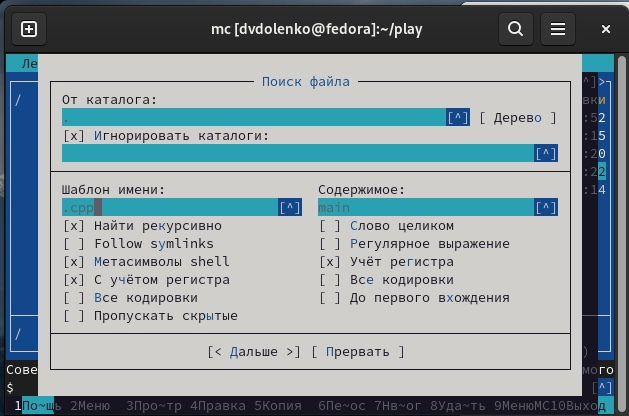
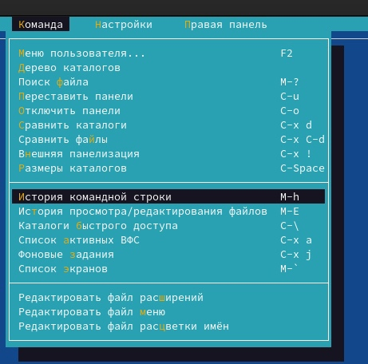
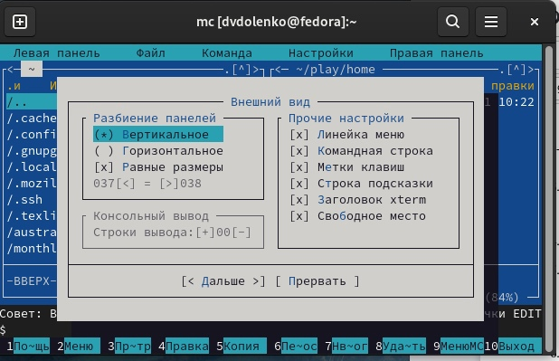
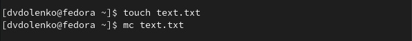
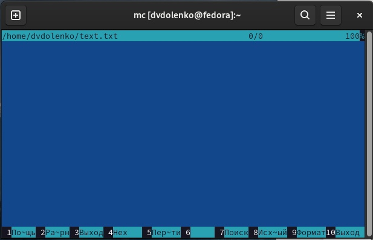
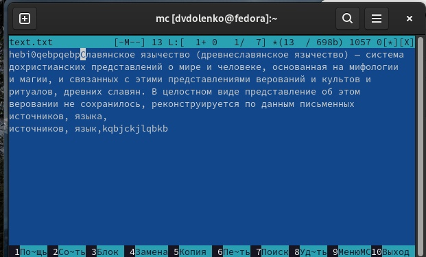

---
## Front matter
lang: ru-RU
title: Командная оболочка Midnight Commander
author: |
	  Доленко Дарья Васильевна НБИбд-01-21\inst{1}

institute: |
	\inst{1}Российский Университет Дружбы Народов

date: 11 мая, 2022, Москва, Россия

## Formatting
mainfont: PT Serif
romanfont: PT Serif
sansfont: PT Sans
monofont: PT Mono
toc: false
slide_level: 2
theme: metropolis
header-includes: 
 - \metroset{progressbar=frametitle,sectionpage=progressbar,numbering=fraction}
 - '\makeatletter'
 - '\beamer@ignorenonframefalse'
 - '\makeatother'
aspectratio: 43
section-titles: true

---

# Цели и задачи работы

## Цель лабораторной работы

Освоение основных возможностей командной оболочки Midnight Commander. Приобретение навыков практической работы по просмотру каталогов и файлов; манипуляций с ними.

# Процесс выполнения лабораторной работы

## Изучаю информацию о mc, вызвав в командной строке man mc. (рис. [-@fig:001])

{#fig:001 width=70%}

## Запускаю из командной строки mc, изучаю его структуру и меню. Выполняю несколько операций в mc, используя управляющие клавиши (рис. [-@fig:002])

{#fig:002 width=70%}

## Выполняю основные команды меню левой панели. Информация о файлах исчерпывающая.(рис. [-@fig:003] [-@fig:004])

{#fig:003 width=70%}

##

{#fig:004 width=70%}

# Используя возможности подменю Файл, выполняю:

## – просмотр содержимого текстового файла;(рис. [-@fig:005])

{#fig:005 width=70%}

## – редактирование содержимого текстового файла (без сохранения результатов редактирования);(рис. [-@fig:006])

{#fig:006 width=70%}

## – создание каталога;(рис. [-@fig:007])

{#fig:007 width=70%}

## – копирование каталога.(рис. [-@fig:008])

{#fig:008 width=70%}

# С помощью соответствующих средств подменю Команда осуществляю:

## – поиск в файловой системе файла с заданными условиями: файл с расширением .cpp, содержащий строку main);(рис. [-@fig:009])

{#fig:009 width=70%}

## – выбор и повторение одной из предыдущих команд;(рис. [-@fig:010])

{#fig:010 width=70%}

## – переход в домашний каталог;(рис. [-@fig:011])

{#fig:011 width=70%}

## – анализ файла меню и файла расширений.(рис. [-@fig:012])

{#fig:012 width=70%}

## Вызываю подменю Настройки. Осваиваю операции, определяющие структуру экрана mc.(рис. [-@fig:013])

{#fig:013 width=70%}

# Задание по встроенному редактору mc

## Создаю текстовой файл text.txt. Открываю этот файл с помощью встроенного в mc редактора. (рис. [-@fig:014] [-@fig:015])

{#fig:014 width=70%}

##

{#fig:015 width=70%}

# Вставляю в открытый файл небольшой фрагмент текста, скопированный из любого другого файла или Интернета. Проделываю с текстом следующие манипуляции, используя горячие клавиши:

## Удаляю строку текста. (Ctrl+y) (рис. [-@fig:016])

{#fig:016 width=70%}

## Выделяю фрагмент текста и копирую его на новую строку. (рис. [-@fig:017])

{#fig:017 width=70%}

## Выделяю фрагмент текста и перенесите его на новую строку.(рис. [-@fig:018])

{#fig:018 width=70%}

## Сохраняю файл. Отменяю последнее действие. (Ctrl+u) (рис. [-@fig:019])

{#fig:019 width=70%}

## Перехожу в конец файла и пишу некоторый текст.(рис. [-@fig:020])

{#fig:020 width=70%}

## Перехожу в начало файла и пишу некоторый текст.(рис. [-@fig:021])

{#fig:021 width=70%}

## Сохраняю и закрываю файл.(рис. [-@fig:022])

{#fig:022 width=70%}

## Открываю файл с исходным текстом на языке программирования С++. Используя меню редактора, включаю подсветку синтаксиса.(рис. [-@fig:023])

{#fig:023 width=70%}

# Выводы по проделанной работе

## Вывод

В ходе данной лабораторной работы я освоила основные возможности командной оболочки Midnight Commander, приобрела навыки практической работы по просмотру каталогов и файлов; манипуляций с ними.
