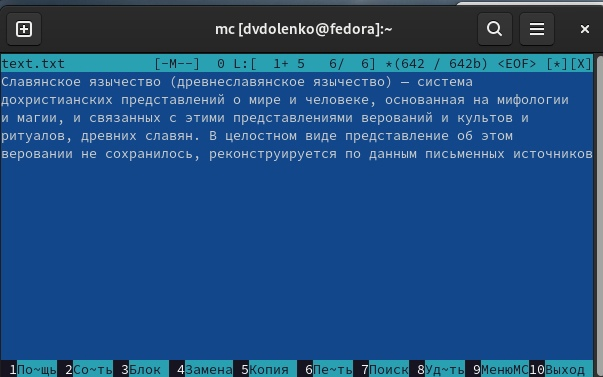

---
## Front matter
title: "Лабораторная работа-06"
subtitle: "Поиск файлов. Перенаправление
ввода-вывода. Просмотр запущенных процессов"
author: "Доленко Дарья Васильевная НБИбд-01-21"

## Generic otions
lang: ru-RU
toc-title: "Содержание"

## Bibliography
bibliography: bib/cite.bib
csl: pandoc/csl/gost-r-7-0-5-2008-numeric.csl

## Pdf output format
toc: true # Table of contents
toc-depth: 2
lof: true # List of figures
lot: true # List of tables
fontsize: 12pt
linestretch: 1.5
papersize: a4
documentclass: scrreprt
## I18n polyglossia
polyglossia-lang:
  name: russian
  options:
	- spelling=modern
	- babelshorthands=true
polyglossia-otherlangs:
  name: english
## I18n babel
babel-lang: russian
babel-otherlangs: english
## Fonts
mainfont: PT Serif
romanfont: PT Serif
sansfont: PT Sans
monofont: PT Mono
mainfontoptions: Ligatures=TeX
romanfontoptions: Ligatures=TeX
sansfontoptions: Ligatures=TeX,Scale=MatchLowercase
monofontoptions: Scale=MatchLowercase,Scale=0.9
## Biblatex
biblatex: true
biblio-style: "gost-numeric"
biblatexoptions:
  - parentracker=true
  - backend=biber
  - hyperref=auto
  - language=auto
  - autolang=other*
  - citestyle=gost-numeric
## Pandoc-crossref LaTeX customization
figureTitle: "Рис."
tableTitle: "Таблица"
listingTitle: "Листинг"
lofTitle: "Список иллюстраций"
lotTitle: "Список таблиц"
lolTitle: "Листинги"
## Misc options
indent: true
header-includes:
  - \usepackage{indentfirst}
  - \usepackage{float} # keep figures where there are in the text
  - \floatplacement{figure}{H} # keep figures where there are in the text
---

# Цель работы

Освоение основных возможностей командной оболочки Midnight Commander. Приобретение навыков практической работы по просмотру каталогов и файлов; манипуляций с ними.

# Выполнение лабораторной работы

Изучаю информацию о mc, вызвав в командной строке man mc. (рис. [-@fig:001])

{#fig:001 width=70%}

Запускаю из командной строки mc, изучаю его структуру и меню. Выполняю несколько операций в mc, используя управляющие клавиши (рис. [-@fig:002])

{#fig:002 width=70%}

Выполняю основные команды меню левой панели. Информация о файлах исчерпывающая.(рис. [-@fig:003] [-@fig:004])

{#fig:003 width=70%}

{#fig:004 width=70%}

Используя возможности подменю Файл, выполняю:

– просмотр содержимого текстового файла;(рис. [-@fig:005])

{#fig:005 width=70%}

– редактирование содержимого текстового файла (без сохранения результатов редактирования);(рис. [-@fig:006])

{#fig:006 width=70%}

– создание каталога;(рис. [-@fig:007])

{#fig:007 width=70%}

– копирование каталога.(рис. [-@fig:008])

{#fig:008 width=70%}

С помощью соответствующих средств подменю Команда осуществляю:

– поиск в файловой системе файла с заданными условиями: файл с расширением .cpp, содержащий строку main);(рис. [-@fig:009])

{#fig:009 width=70%}

– выбор и повторение одной из предыдущих команд;(рис. [-@fig:010])

{#fig:010 width=70%}

– переход в домашний каталог;(рис. [-@fig:011])

{#fig:011 width=70%}

– анализ файла меню и файла расширений.(рис. [-@fig:012])

{#fig:012 width=70%}

Вызываю подменю Настройки. Осваиваю операции, определяющие структуру экрана mc.(рис. [-@fig:013])

{#fig:013 width=70%}

# Задание по встроенному редактору mc

Создаю текстовой файл text.txt. Открываю этот файл с помощью встроенного в mc редактора. (рис. [-@fig:014] [-@fig:015])

{#fig:014 width=70%}

{#fig:015 width=70%}

Вставляю в открытый файл небольшой фрагмент текста, скопированный из любого другого файла или Интернета. Проделываю с текстом следующие манипуляции, используя горячие клавиши:

Удаляю строку текста. (Ctrl+y) (рис. [-@fig:016])

{#fig:016 width=70%}

Выделяю фрагмент текста и копирую его на новую строку. (рис. [-@fig:017])

{#fig:017 width=70%}

Выделяю фрагмент текста и перенесите его на новую строку.(рис. [-@fig:018])

{#fig:018 width=70%}

Сохраняю файл. Отменяю последнее действие. (Ctrl+u) (рис. [-@fig:019])

{#fig:019 width=70%}

Перехожу в конец файла и пишу некоторый текст.(рис. [-@fig:020])

{#fig:020 width=70%}

Перехожу в начало файла и пишу некоторый текст.(рис. [-@fig:021])

{#fig:021 width=70%}

Сохраняю и закрываю файл.(рис. [-@fig:022])

{#fig:022 width=70%}

Открываю файл с исходным текстом на языке программирования С++. Используя меню редактора, включаю подсветку синтаксиса.(рис. [-@fig:023])

{#fig:023 width=70%}

# Вывод

В ходе данной лабораторной работы я освоила основные возможности командной оболочки Midnight Commander, приобрела навыки практической работы по просмотру каталогов и файлов; манипуляций с ними.

# Контрольные вопросы

1. Какие режимы работы есть в mc. Охарактеризуйте их.
2. Kакие операции с файлами можно выполнить как с помощью команд shell,так и с помощью меню (комбинаций клавиш) mc? Приведите несколько примеров.
3. Опишите структура меню левой (или правой) панели mc, дайте характеристику командам.
4. Опишите структура меню Файл mc, дайте характеристику командам.
5. Опишите структура меню Команда mc, дайте характеристику командам.
6. пишите структура меню Настройки mc, дайте характеристику командам.
7. Назовите и дайте характеристику встроенным командам mc.
8. Назовите и дайте характеристику командам встроенного редактора mc.
9. Дайте характеристику средствам mc, которые позволяют создавать меню, определяемые пользователем.
10. Дайте характеристику средствам mc, которые позволяют выполнять действия,определяемые пользователем, над текущим файлом.

# Ответы на контрольные вопросы:

1. Экран MC делится на четыре части. Почти весь зкран занят двумя панелями. По умолчанию, вторая строка снизу является командной, а в самой нижней отображается назначение функциональных клавиш. Самая верхняя строка - строка меню. Она может быть не видна, но при нажатии клавиши F9 или при щелчке мыши эта строка отображается в верхней части экрана. MC позволяет одновременно наблюдать содержимое двух каталогов. Одна из панелей является текущей (в этой панели находится выделитель). Практически все команды оперируют над текущей панелью. Хотя некоторые файловые операции, такие как Rename или Copy, по умолчанию используют каталог неактивной панели в качестве каталога назначения (при выполнении подобных команд всегда появляется запрос на подтверждение).

2. Операции с файлами можно выполнить как с помощью команд shell, так и с помощью меню (комбинаций клавиш) mc. Например, создание каталогов, копирование файлов, вывод информации о файле.

3. Структура меню левой (или правой) панели mc, характеристика команд:

    список файлов (этот режим используется для просмотра списка файлов).
    быстрый просмотр (в этом режиме панель переключается в режим вьюера, который показывает содержимое текущего файла; если выбрать эту панель (нажав клавишу Tab или при помощи мыши), то здесь можно пользоваться стандартными командами вьюера).
    информация (в этом режиме отображается информация, связанная с текущим файлом и, по возможности, информация о текущей файловой системе).
    дерево (этот режим идентичен функции отображения дерева каталогов).
    порядок сортировки (существует восемь типов сортировки файлов: по имени, по расширению, по времени последней модификации файла, по времени последнего доступа к файлу, по времени модификации индексного дескриптора, по размеру, по значению индексного деакриптора и без порядка. В диалоговом окне Sort order можно выбрать тип сортировки, а также указать, что сортировку следует производить в обратном порядке).
    фильтр (эта команда позволяет указать шаблон для файлов, которые должны отображаться; вне зависимости от шаблона, каталоги и ссылки к каталогам отображаются всегда).

4. Структура меню Файл mc, характеристика команд: – просмотр — позволяет посмотреть содержимое текущего (или выделенного) файла без возможности редактирования. – просмотр вывода команды — функция запроса команды с параметрами (аргумент к текущему выбранному файлу). – правка — открывает текущий (или выделенный) файл для его редактирования. – копирование — осуществляет копирование одного или нескольких файлов или каталогов в указанное пользователем во всплывающем окне место. – права доступа — позволяет указать (изменить) права доступа к одному или нескольким файлам или каталогам. – жёсткая ссылка — позволяет создать жёсткую ссылку к текущему (или выделенному) файлу1. – символическая ссылка — позволяет создать символическую ссылку к текущему (или выделенному) файлу2. – владелец/группа — позволяет задать (изменить) владельца и имя группы для одного или нескольких файлов или каталогов. – права (расширенные) — позволяет изменить права доступа и владения для одного или нескольких файлов или каталогов. – переименование — позволяет переименовать (или переместить) один или несколько файлов или каталогов. – создание каталога — позволяет создать каталог. – удалить — позволяет удалить один или несколько файлов или каталогов. – выход — завершает работу mc.

5. Структура меню Команда mc, характеристика команд: – дерево каталогов — отображает структуру каталогов системы. – поиск файла — выполняет поиск файлов по заданным параметрам. – переставить панели — меняет местами левую и правую панели. – сравнить каталоги — сравнивает содержимое двух каталогов. – размеры каталогов — отображает размер и время изменения каталога (по умолчанию в mc размер каталога корректно не отображается). – история командной строки — выводит на экран список ранее выполненных в оболочке команд. – каталоги быстрого доступа — при вызове выполняется быстрая смена текущего каталога на один из заданного списка. – восстановление файлов — позволяет восстановить файлы на файловых системах ext2 и ext3. – редактировать файл расширений — позволяет задать с помощью определённого синтаксиса действия при запуске файлов с определённым расширением (например, какое программного обеспечение запускать для открытия или редактирования файлов с расширением doc или docx). – редактировать файл меню — позволяет отредактировать контекстное меню пользователя, вызываемое по клавише F2. – редактировать файл расцветки имён — позволяет подобрать оптимальную для пользователя расцветку имён файлов в зависимости от их типа.

6. Структура меню Настройки mc, характеристика команд: – конфигурация — позволяет скорректировать настройки работы с панелями. – внешний вид и настройки панелей — определяет элементы (строка меню, командная строка, подсказки и прочее), отображаемые при вызове mc, а также геометрию расположения панелей и цветовыделение. – биты символов — задаёт формат обработки информации локальным терминалом. – подтверждение — позволяет установить или убрать вывод окна с запросом подтверждения действий при операциях удаления и перезаписи файлов, а также при выходе из программы. – распознание клавиш — диалоговое окно используется для тестирования функциональных клавиш, клавиш управления курсором и прочее. – виртуальные ФС –– настройки виртуальной файловой системы: тайм-аут, пароль и прочее.

7. Характеристика встроенных команд mc.

    F1 Вызов контекстно-зависимой подсказки
    F2 Вызов пользовательского меню с возможностью создания и/или дополнения дополнительных функций
    F3 Просмотр содержимого файла, на который указывает подсветка в активной панели (без возможности редактирования)
    F4 Вызов встроенного в mc редактора для изменения содержания файла, на который указывает подсветка в активной панели
    F5 Копирование одного или нескольких файлов, отмеченных в первой (активной) панели, в каталог, отображаемый на второй панели
    F6 Перенос одного или нескольких файлов, отмеченных в первой (активной) панели, в каталог, отображаемый на второй панели
    F7 Создание подкаталога в каталоге, отображаемом в активной панели
    F8 Удаление одного или нескольких файлов (каталогов), отмеченных в первой (активной) панели файлов
    F9 Вызов меню mc
    F10 Выход из mc

8. Характеристика команд встроенного редактора mc. M-Enter копирует подсвеченное имя файла или каталога в командную строку. C-Enter то же самое, что M-Enter, но работает только на консоли Linux. M-Tab пытается выполнить операцию завершение ввода (completion) имени файла, названия команды, переменной, имени пользователя или имени машины (в зависимости от того, что вы начали набирать и какой элемент команды вводите). C-x t, C-x C-t копирует в командную строку имена помеченных файлов (или подсвеченное имя, если нет помеченных) из активной панели (C-x t) или пассивной панели (C-x C-T). C-x p, C-x C-p первая комбинация клавиш копирует в командную строку имя текущего каталога, а вторая - имя каталога, отображаемого в пассивной панели. C-q эта команда (the quote command) используется для того, чтобы вставить символы, которые каким-то образом интерпретируются самим Midnight Commander-ом (например, символ '+'). M-p, M-n эти комбинации используются для перемещения по истории команд. M-p вызывает перемещение на команду назад по списку ранее запускавшихся команд, а M-n - перемещение на одну команду вперед. M-h выводит историю текущей строки ввода (для командной строки - историю команд).

9. Характеристика средств mc, которые позволяют создавать меню, определяемых пользователем. Перейти в строку меню панелей mc можно с помощью функциональной клавиши F9. В строке меню имеются пять меню: Левая панель, Файл, Команда, Настройки и Правая панель. Подпункт меню Быстрый просмотр позволяет выполнить быстрый просмотр содержимого панели. Подпункт меню Информация позволяет посмотреть информацию о файле или каталоге. В меню каждой (левой или правой) панели можно выбрать Формат списка: – стандартный — выводит список файлов и каталогов с указанием размера и времени правки; – ускоренный — позволяет задать число столбцов, на которые разбивается панель при выводе списка имён файлов или каталогов без дополнительной информации; – расширенный — помимо названия файла или каталога выводит сведения о правах доступа, владельце, группе, размере, времени правки; – определённый пользователем — позволяет вывести те сведения о файле или каталоге, которые задаст сам пользователь. Подпункт меню Порядок сортировки позволяет задать критерии сортировки при выводе списка файлов и каталогов: без сортировки, по имени, расширенный, время правки, время доступа, время изменения атрибута, размер, узел.

10. Средств mc, которые позволяют выполнять действия, определяемые пользователем, над текущим файлом: все команды, содержащиеся в меню в левой(правой) панели, файле, команде, настройках.

# Список литературы{.unnumbered}

::: {#refs}
:::

1. [Лекция Системы контроля версий] (http://uii.mpei.ru/study/courses/sdt/16/lecture02.2_vcs.slides.pdf)
2. ССылка на литературу [@lit01]

