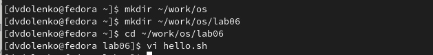
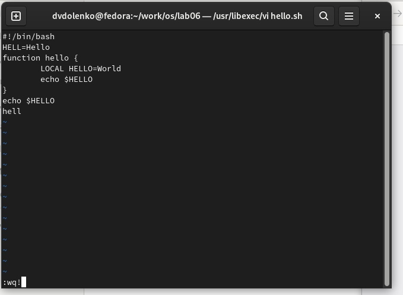

---
## Front matter
lang: ru-RU
title: Текстовой редактор vi
author: |
	  Доленко Дарья Васильевна НБИбд-01-21\inst{1}

institute: |
	\inst{1}Российский Университет Дружбы Народов

date: 11 мая, 2022, Москва, Россия

## Formatting
mainfont: PT Serif
romanfont: PT Serif
sansfont: PT Sans
monofont: PT Mono
toc: false
slide_level: 2
theme: metropolis
header-includes: 
 - \metroset{progressbar=frametitle,sectionpage=progressbar,numbering=fraction}
 - '\makeatletter'
 - '\beamer@ignorenonframefalse'
 - '\makeatother'
aspectratio: 43
section-titles: true

---

# Цели и задачи работы

## Цель лабораторной работы

Познакомиться с операционной системой Linux.Получить практические навыки работы с редактором vi,установленным по умолчанию практически во всех дистрибутивах.

# Процесс выполнения лабораторной работы

# Задание 1. Создание нового файла с использованием vi.

## Создаю каталог с именем ~/work/os/lab06. Перехожу во вновь созданный каталог. Вызываю vi и создаю файл hello.sh (рис. [-@fig:001])

{#fig:001 width=70%}

## Нажимаю клавишу i и ввожу указанный текст. Нажимаю клавишу Esc для перехода в командный режим после завершения ввода текста. Нажимаю : для перехода в режим последней строки и внизу моего экрана появляется приглашение в виде двоеточия. Нажимаю w (записать)и q (выйти), затем нажимаю клавишу Enter для сохранения моего текста и завершения работ. (рис. [-@fig:002])

{#fig:002 width=70%}

## Делаю файл исполняемым. (рис. [-@fig:003])

{#fig:003 width=70%}

# Задание 2. Редактирование существующего файла.

## Вызываю vi на редактирование файла. (рис. [-@fig:004])

{#fig:004 width=70%}

## Устанавливаю курсор в конец слова HELL второй строки, в режиме вставки заменяю на HELLO. Устанавливаю курсор на четвертую строку и стираю слово LOCAL. В режиме вставки набираю local. Вставляю после текста строку echo $HELLO. Удаляю последнюю строку командой dd. Ввожу команду отмены изменений u для отмены последней команды. Ввожу символ : для перехода в режим последней строки. Записываю изменения (команда w) и выхожу из vi(комнада q). (рис. [-@fig:005] [-@fig:006] [-@fig:007])

{#fig:005 width=70%}

##

{#fig:006 width=70%}

##

{#fig:007 width=70%}

# Выводы по проделанной работе

## Вывод

В ходе данной лабораторной работы я познакомилась с операционной системой Linux, получила практические навыки работы с редактором vi,установленным по умолчанию практически во всех дистрибутивах.
