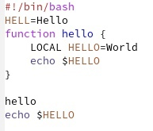
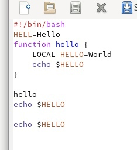
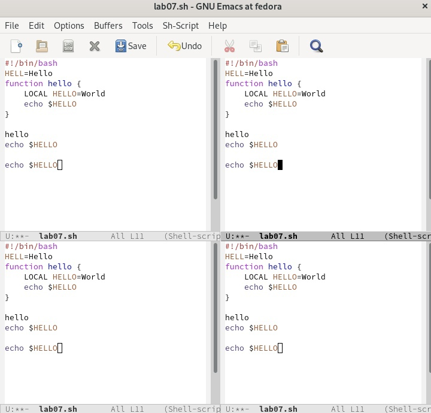
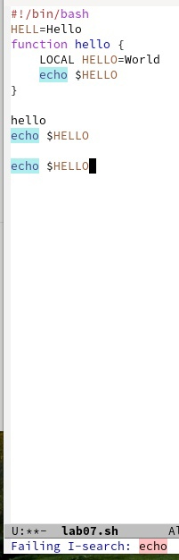

---
## Front matter
lang: ru-RU
title: Текстовой редактор emacs
author: |
	  Доленко Дарья Васильевна НБИбд-01-21\inst{1}

institute: |
	\inst{1}Российский Университет Дружбы Народов

date: 19 мая, 2022, Москва, Россия

## Formatting
mainfont: PT Serif
romanfont: PT Serif
sansfont: PT Sans
monofont: PT Mono
toc: false
slide_level: 2
theme: metropolis
header-includes: 
 - \metroset{progressbar=frametitle,sectionpage=progressbar,numbering=fraction}
 - '\makeatletter'
 - '\beamer@ignorenonframefalse'
 - '\makeatother'
aspectratio: 43
section-titles: true

---

# Цели и задачи работы

## Цель лабораторной работы

Познакомиться с операционной системой Linux. Получить практические навыки работы с редактором Emacs.

# Процесс выполнения лабораторной работы

## Открываю emacs.(рис. [-@fig:001])

{#fig:001 width=70%}

## Создаю файл lab07.sh с помощью комбинации Ctrl-x Ctrl-f. Набераю приведенный текст. Сохраняю файл с помощью комбинации Ctrl-x Ctrl-s (C-x C-s). (рис. [-@fig:002])

{#fig:002 width=70%}

# Проделываю с текстом стандартные процедуры редактирования, каждое действие должно осуществляться комбинацией клавиш.

## Вырезаю одной командой целую строку (С-k).(рис. [-@fig:003])

{#fig:003 width=70%}

## Вставляю эту строку в конец файла (C-y). (рис. [-@fig:004])

{#fig:004 width=70%}

## Выделяю область текста (C-space). Копирую область в буфер обмена (M-w). Вставляю область в конец файла.(рис. [-@fig:005])

{#fig:005 width=70%}

## Выделяю эту область и на этот раз вырезаю её (C-w), отменяю последнее действие (C-/).

# Учучь использовать команды по перемещению курсора

## Перемещаю курсор в конец строки (C-е). (рис. [-@fig:006])

{#fig:006 width=70%}
 
## Перемещаю курсор в конец строки (C-а). (рис. [-@fig:007])

{#fig:007 width=70%}
 
## Затем перемещаю курсор в начало буфера (M-<), перемещаю курсор в конец буфера (M->).

## Управляю буферами: вывожу список активных буферов на экран (C-x C-b) (рис. [-@fig:008])

{#fig:008 width=70%}

# Перемещаюсь во вновь открытое окно (C-x) o со списком открытых буферов и перемещаюсь на другой буфер.

## Закрываю это окно (C-x 0).
 
## Теперь вновь переключаюсь между буферами, но уже без вывода их списка на
экран (C-x b). (рис. [-@fig:009])

{#fig:009 width=70%}

## Делю фрейм на 4 части: на два окна по вертикали (C-x 3), а затем каждое из этих окон на две части по горизонтали (C-x 2)  В каждом из четырёх созданных окон открываю новый буфер (файл) и ввожу
несколько строк текста. (рис. [-@fig:010])

{#fig:010 width=70%}

# Режим поиска:

## Переключаюсь в режим поиска (C-s) и нахожу несколько слов, присутствующих в тексте. Переключаюсь между результатами поиска,нажимая C-s. Выхожу нажав C-g. (рис. [-@fig:011])

{#fig:011 width=70%}

## Перехожу в режим поиска и замены (M-%), ввожу текст, который следует найти и заменить, нажимаю Enter , затем введите текст для замены. После того как будут подсвечены результаты поиска, нажимаю ! для подтверждения замены. (рис. [-@fig:012])

{#fig:012 width=70%}

## Пробую другой режим поиска, нажав M-s o. (рис. [-@fig:013])

{#fig:013 width=70%}

# Выводы по проделанной работе

## Вывод

В ходе данной лабораторной работы я ознакомилась с операционной системой Linux. Получила практические навыки работы с редактором Emacs.
