---
## Front matter
title: "Лабораторная работа-09"
subtitle: "Текстовой редактор emacs"
author: "Доленко Дарья Васильевная НБИбд-01-21"

## Generic otions
lang: ru-RU
toc-title: "Содержание"

## Bibliography
bibliography: bib/cite.bib
csl: pandoc/csl/gost-r-7-0-5-2008-numeric.csl

## Pdf output format
toc: true # Table of contents
toc-depth: 2
lof: true # List of figures
lot: true # List of tables
fontsize: 12pt
linestretch: 1.5
papersize: a4
documentclass: scrreprt
## I18n polyglossia
polyglossia-lang:
  name: russian
  options:
	- spelling=modern
	- babelshorthands=true
polyglossia-otherlangs:
  name: english
## I18n babel
babel-lang: russian
babel-otherlangs: english
## Fonts
mainfont: PT Serif
romanfont: PT Serif
sansfont: PT Sans
monofont: PT Mono
mainfontoptions: Ligatures=TeX
romanfontoptions: Ligatures=TeX
sansfontoptions: Ligatures=TeX,Scale=MatchLowercase
monofontoptions: Scale=MatchLowercase,Scale=0.9
## Biblatex
biblatex: true
biblio-style: "gost-numeric"
biblatexoptions:
  - parentracker=true
  - backend=biber
  - hyperref=auto
  - language=auto
  - autolang=other*
  - citestyle=gost-numeric
## Pandoc-crossref LaTeX customization
figureTitle: "Рис."
listingTitle: "Листинг"
lofTitle: "Список иллюстраций"
lolTitle: "Листинги"
## Misc options
indent: true
header-includes:
  - \usepackage{indentfirst}
  - \usepackage{float} # keep figures where there are in the text
  - \floatplacement{figure}{H} # keep figures where there are in the text
---

# Цель работы

Познакомиться с операционной системой Linux. Получить практические навыки работы с редактором Emacs.

# Выполнение лабораторной работы

Открываю emacs.(рис. [-@fig:001])

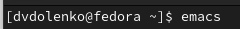{#fig:001 width=70%}

Создаю файл lab07.sh с помощью комбинации Ctrl-x Ctrl-f. Набераю приведенный текст. Сохраняю файл с помощью комбинации Ctrl-x Ctrl-s (C-x C-s). (рис. [-@fig:002])

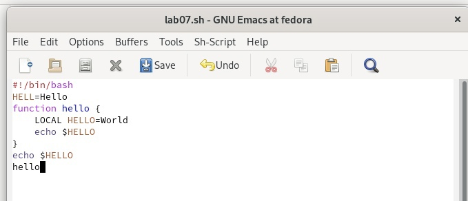{#fig:002 width=70%}

# Проделываю с текстом стандартные процедуры редактирования, каждое действие должно осуществляться комбинацией клавиш.

Вырезаю одной командой целую строку (С-k).(рис. [-@fig:003])

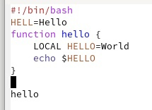{#fig:003 width=70%}

Вставляю эту строку в конец файла (C-y). (рис. [-@fig:004])

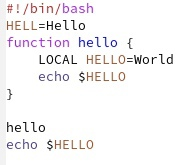{#fig:004 width=70%}

Выделяю область текста (C-space). Копирую область в буфер обмена (M-w). Вставляю область в конец файла.(рис. [-@fig:005])

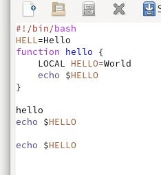{#fig:005 width=70%}

Выделяю эту область и на этот раз вырезаю её (C-w), отменяю последнее действие (C-/).

# Учучь использовать команды по перемещению курсора

 Перемещаю курсор в конец строки (C-е). (рис. [-@fig:006])

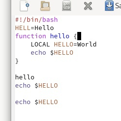{#fig:006 width=70%}
 
 Перемещаю курсор в конец строки (C-а). (рис. [-@fig:007])

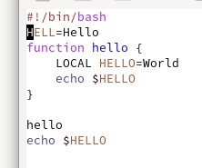{#fig:007 width=70%}
 
 Затем перемещаю курсор в начало буфера (M-<), перемещаю курсор в конец буфера (M->).

 Управляю буферами: вывожу список активных буферов на экран (C-x C-b) (рис. [-@fig:008])

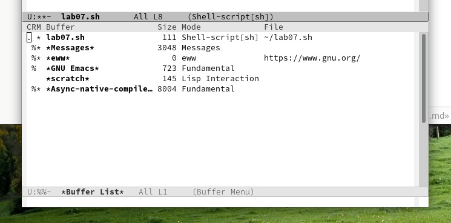{#fig:008 width=70%}

# Перемещаюсь во вновь открытое окно (C-x) o со списком открытых буферов и перемещаюсь на другой буфер.

 Закрываю это окно (C-x 0).
 
 Теперь вновь переключаюсь между буферами, но уже без вывода их списка на
экран (C-x b). (рис. [-@fig:009])

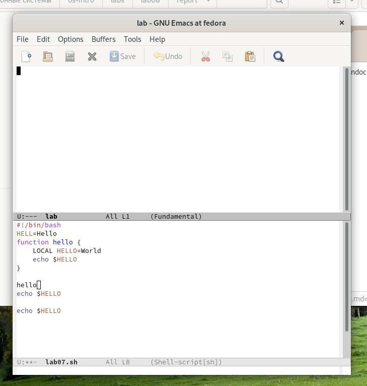{#fig:009 width=70%}

 Делю фрейм на 4 части: на два окна по вертикали (C-x 3), а затем каждое из этих окон на две части по горизонтали (C-x 2)  В каждом из четырёх созданных окон открываю новый буфер (файл) и ввожу
несколько строк текста. (рис. [-@fig:010])

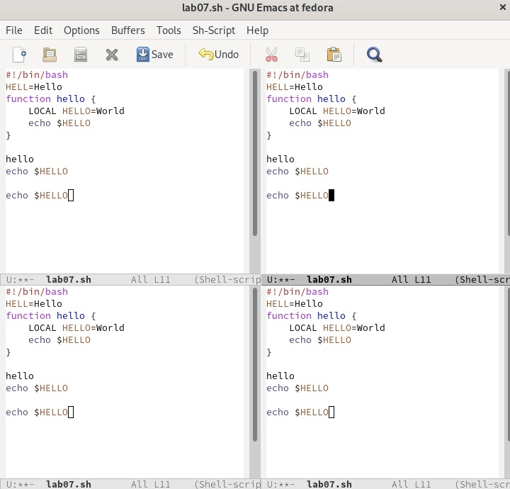{#fig:010 width=70%}

# Режим поиска:

 Переключаюсь в режим поиска (C-s) и нахожу несколько слов, присутствующих в тексте. Переключаюсь между результатами поиска,нажимая C-s. Выхожу нажав C-g. (рис. [-@fig:011])

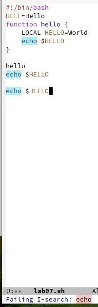{#fig:011 width=70%}

 Перехожу в режим поиска и замены (M-%), ввожу текст, который следует найти и заменить, нажимаю Enter , затем введите текст для замены. После того как будут подсвечены результаты поиска, нажимаю ! для подтверждения замены. (рис. [-@fig:012])

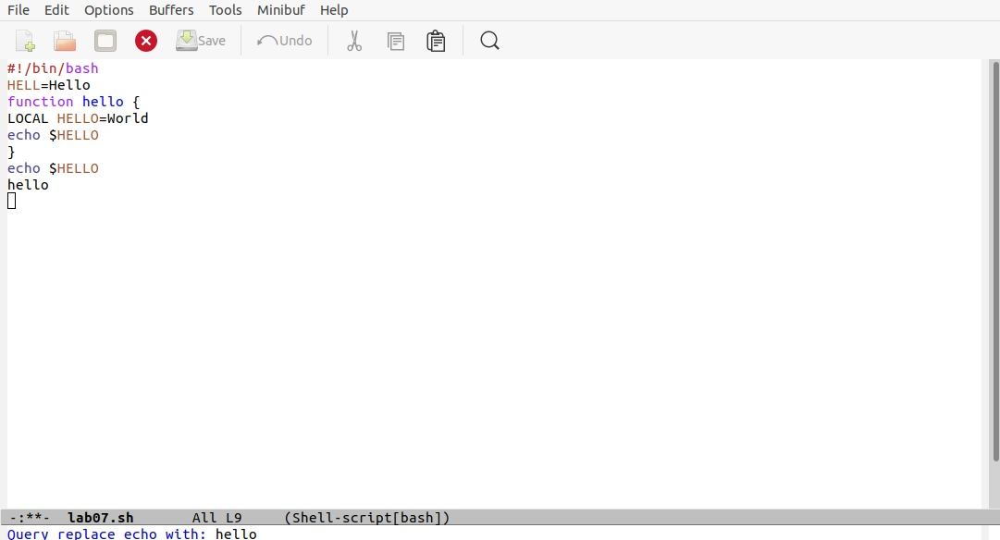{#fig:012 width=70%}

 Пробую другой режим поиска, нажав M-s o. (рис. [-@fig:013])

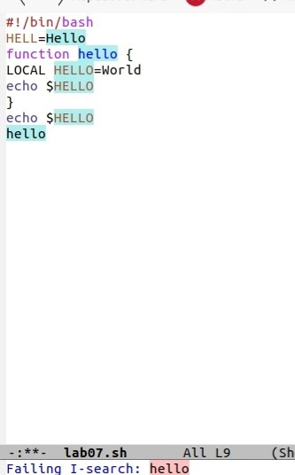{#fig:013 width=70%}

# Вывод

В ходе данной лабораторной работы я ознакомилась с операционной системой Linux. Получила практические навыки работы с редактором Emacs.

# Контрольные вопросы

1. Кратко охарактеризуйте редактор emacs.

2.  Какие особенности данного редактора могутсделать его сложным для освоения новичком?

3. Своими словами опишите,чтотакое буфер и окно втерминологии emacs’а.

4. Можно ли открыть больше 10 буферов в одном окне?

5. Какие буферы создаются по умолчанию при запуске emacs?

6. Какие клавиши вы нажмёте,чтобы ввести следующую комбинацию C-c | и C-c C-|?

7. Как поделитьтекущее окно на две части?

8. В каком файле хранятся настройки редактора emacs?

9. Какую функцию выполняет клавиша и можно ли её переназначить?

10. Какой редактор вам показался удобнее в работе vi или emacs? Поясните почему.

# Ответы на контрольные вопросы:

1. Emacs представляет собой мощный экранный редактор текста, написанный на языке высокого уровня Elisp.

2. Развитие Emacs в сторону его многогранности послужило причиной того, что и без того интуитивно непонятная программа стала чрезвычайно сложной в применении. В частности, управление осуществляется при помощи различных клавиатурных комбинаций, запомнить которые будет непросто.

3. Буфер – что-то, состоящее из текста. Окно – область с одним из буферов.

4. В одном окне можно открыть больше 10 буферов.

5. После запуска emacs без каких-либо параметров в основном окне отображается буфер scratch, который используется для оценки выражений Emacs Lisp, а также для заметок, которые вы не хотите сохранять. Этот буфер не сохраняется автоматически.

6. Чтобы ввести следующую комбинацию C-c | я нажму клавиши: Control+c и Shift+, и для C-c C-|: Control+c и Control+Shift+.

7. Поделить текущее окно на две части можно двумя комбинациями клавиш: C-x 3 или C-x 2.

8. Настроить или расширить Emacs можно написав или изменив файл ~/.emacs.

9. Клавиша  выполняет функцию перемещения курсора в открытом окне также, как и многие другие клавиши её можно переназначить.

10. Редактор emacs показался мне удобнее из-за возможности открытия нескольких окон с буферами и работать комбинациями клавиш в этот редакторе мне было проще.

# Список литературы{.unnumbered}

::: {#refs}
:::

1. [Лекция Системы контроля версий] (http://uii.mpei.ru/study/courses/sdt/16/lecture02.2_vcs.slides.pdf)
2. ССылка на литературу [@lit01]

