---
## Front matter
lang: ru-RU
title: Программирование в командном процессоре ОС UNIX. Командные файлы
author: |
	  Доленко Дарья Васильевна НБИбд-01-21\inst{1}

institute: |
	\inst{1}Российский Университет Дружбы Народов

date: 19 мая, 2022, Москва, Россия

## Formatting
mainfont: PT Serif
romanfont: PT Serif
sansfont: PT Sans
monofont: PT Mono
toc: false
slide_level: 2
theme: metropolis
header-includes: 
 - \metroset{progressbar=frametitle,sectionpage=progressbar,numbering=fraction}
 - '\makeatletter'
 - '\beamer@ignorenonframefalse'
 - '\makeatother'
aspectratio: 43
section-titles: true

---

# Цели и задачи работы

## Цель лабораторной работы

Изучить основы программирования в оболочке ОС UNIX/Linux. Научиться писать небольшие командные файлы

# Процесс выполнения лабораторной работы

## Часть 1

Пишу скрипт, который при запуске будет делать резервную копию самого себя в другую директорию backup
в домашнем каталоге. При этом файл архивируется архиватором zip. Способ использования команд архивации
необходимо было узнать, изучив справку. (рис. [-@fig:001][-@fig:002][-@fig:003][-@fig:004][-@fig:005])

##

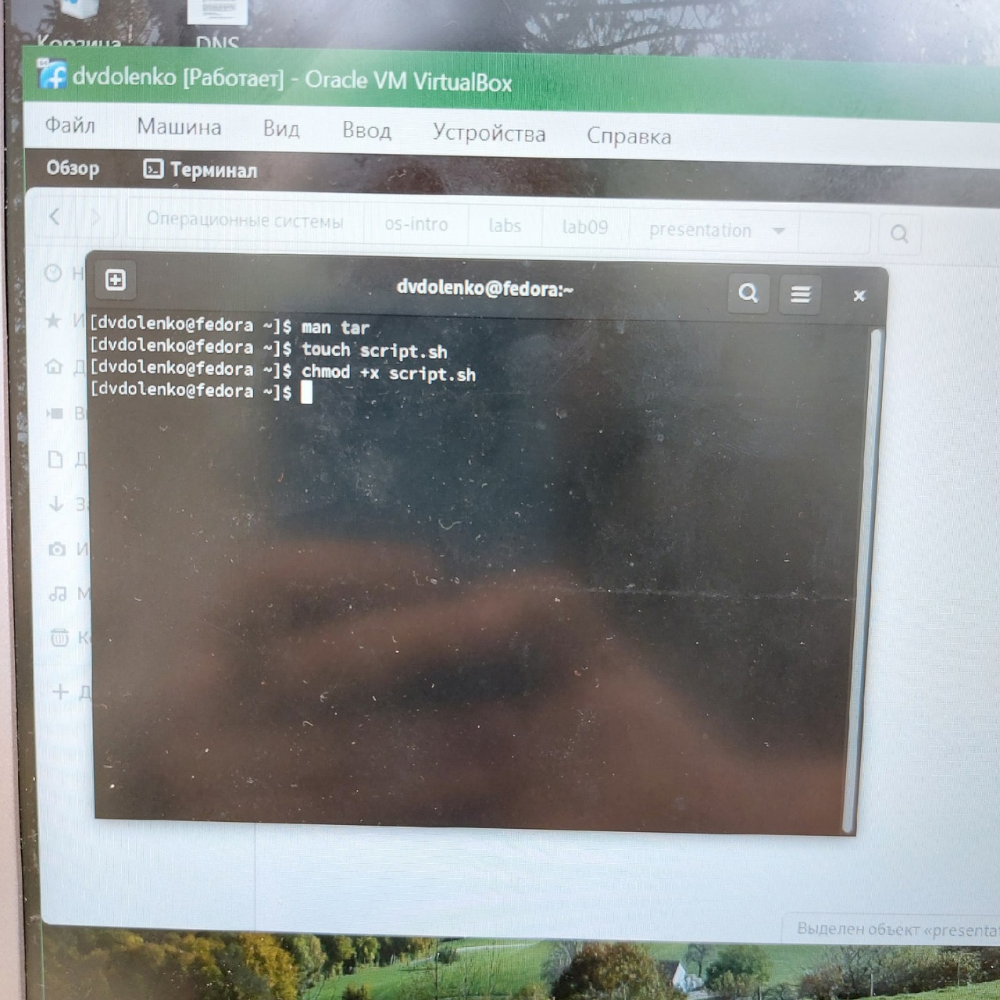{#fig:001 width=70%}

##

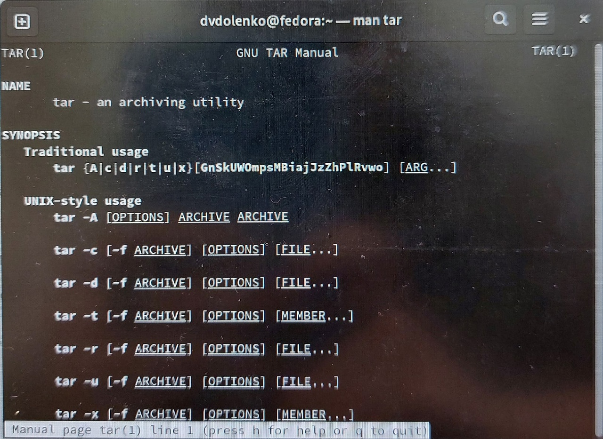{#fig:002 width=70%}

##

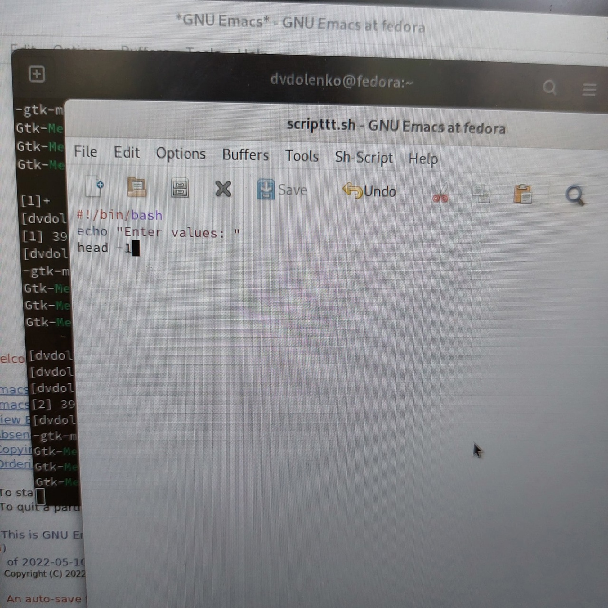{#fig:003 width=70%}

##

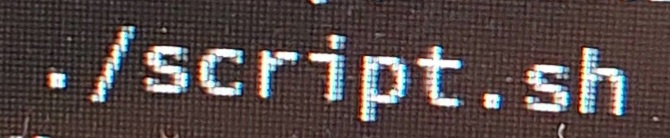{#fig:004 width=70%}

##

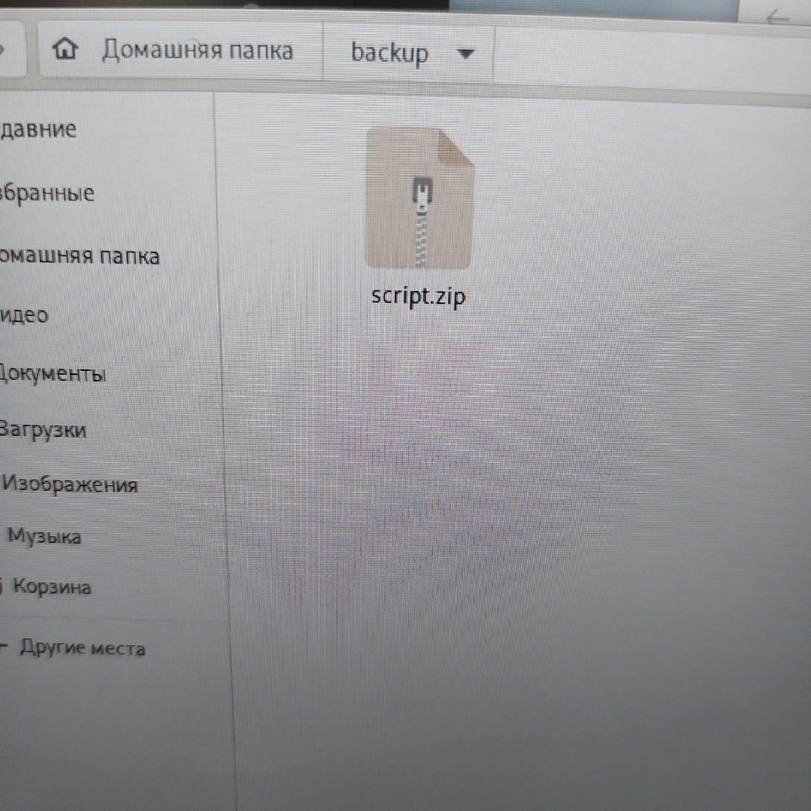{#fig:005 width=70%}

## Часть 2

Написала пример командного файла, обрабатывающего любое произвольное число
аргументов командной строки, в том числе превышающее десять. Скрипт последовательно распечатывает значения всех переданных аргументов. (рис. [-@fig:006][-@fig:007])

##

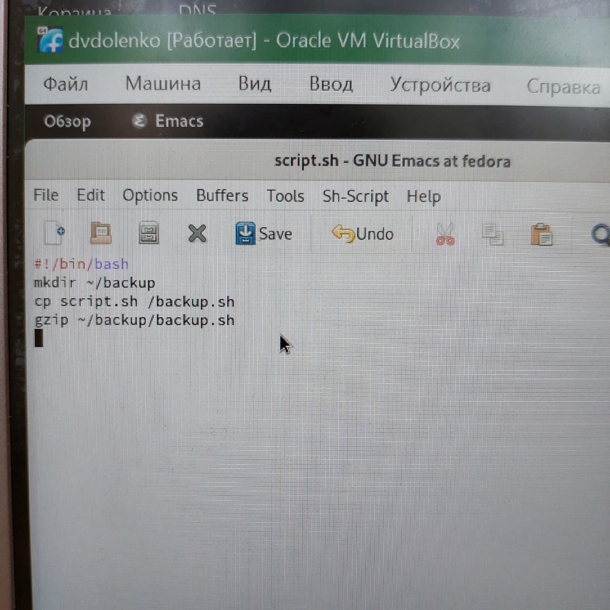{#fig:006 width=70%}

##

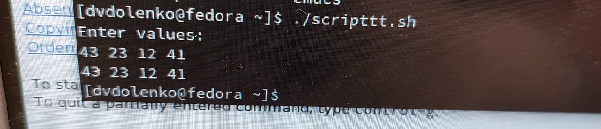{#fig:007 width=70%}

## Часть 3

Написала командный файл—аналогкоманды ls.(рис. [-@fig:008][-@fig:009])

##

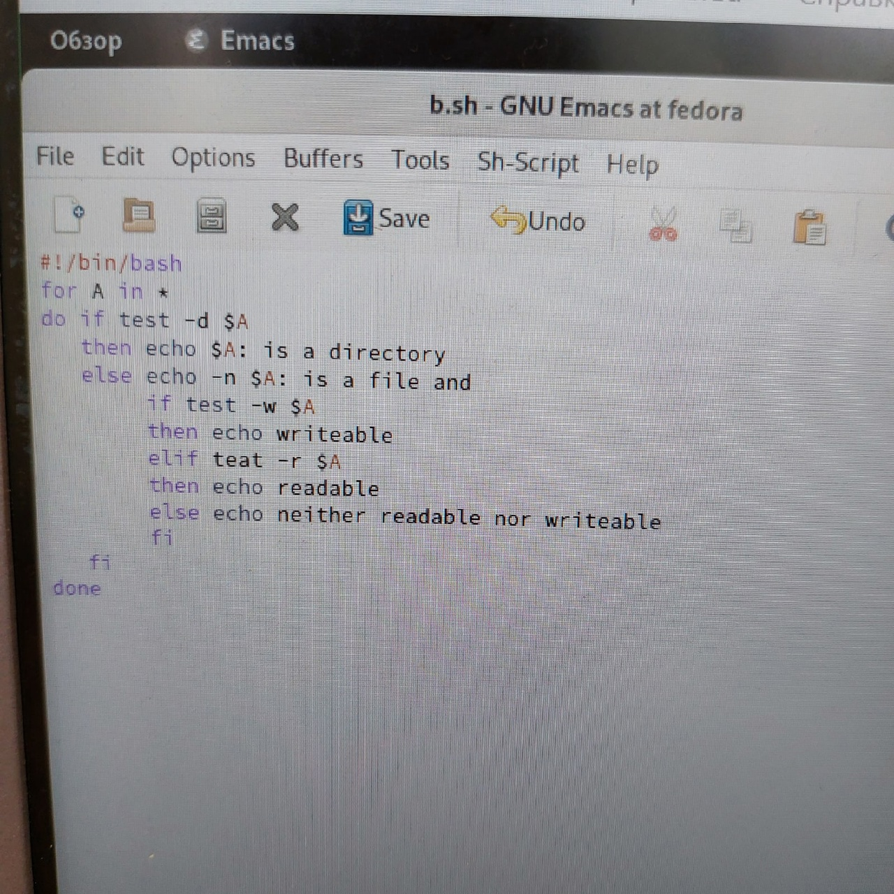{#fig:008 width=70%}

##

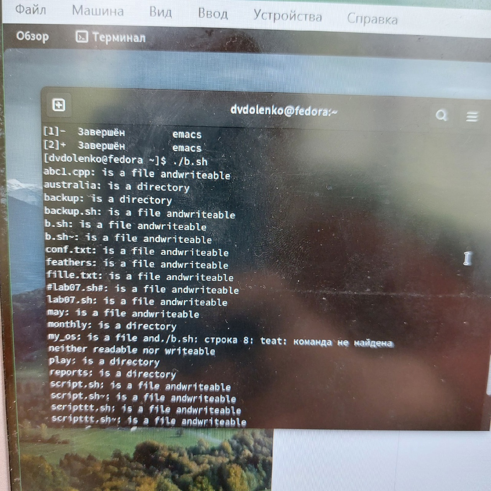{#fig:009 width=70%}

## Часть 4

Написала командный файл, который получает в качестве аргумента командной строки формат файла (.txt, .doc, .jpg, .pdf и т.д.) и вычисляет количество таких файлов в указанной директории. Путь к директории также передаётся в виде аргумента командной строки. (рис. [-@fig:010][-@fig:011])

##

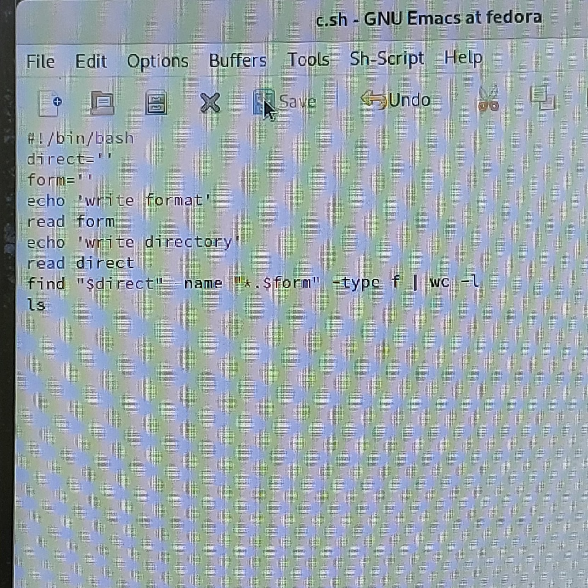{#fig:010 width=70%}

##

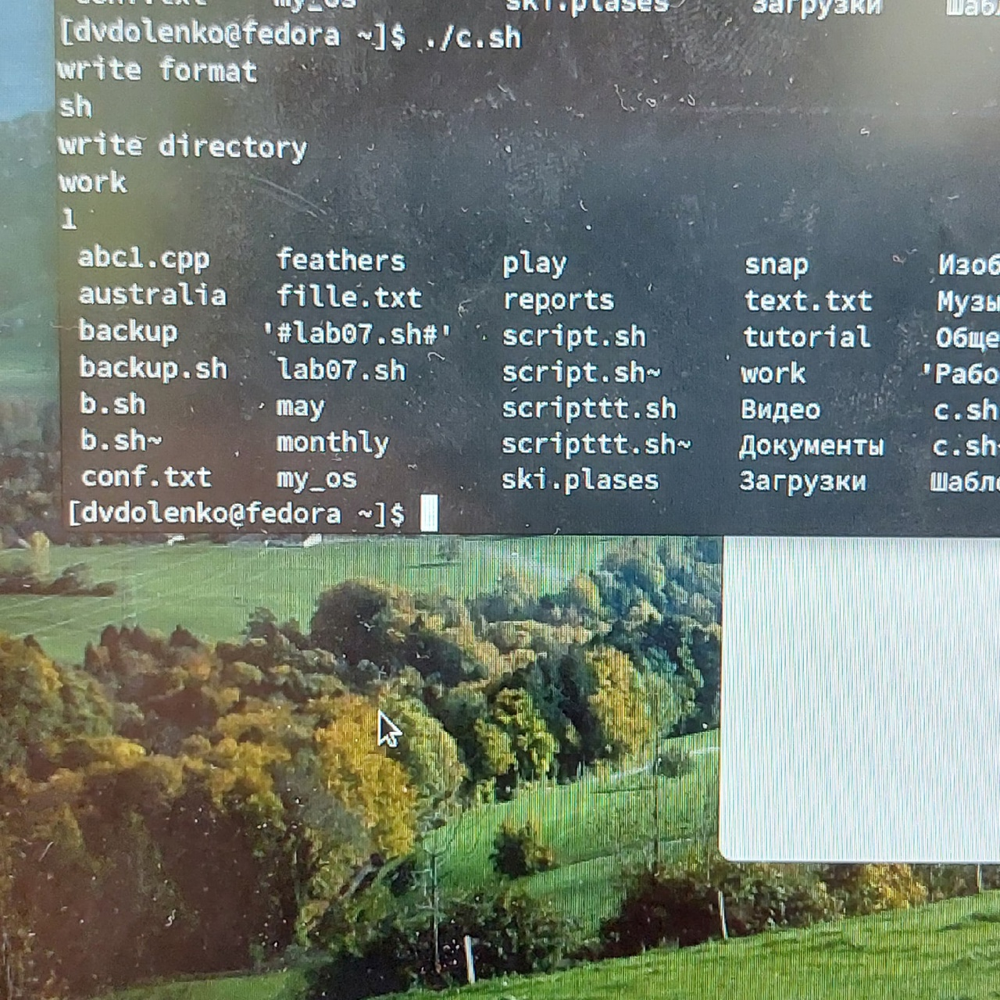{#fig:011 width=70%}

# Выводы по проделанной работе

## Вывод

В ходе данной лабораторной работы я изучила основы программирования в оболочке ОС UNIX/Linux, научилась писать небольшие командные файлы.
