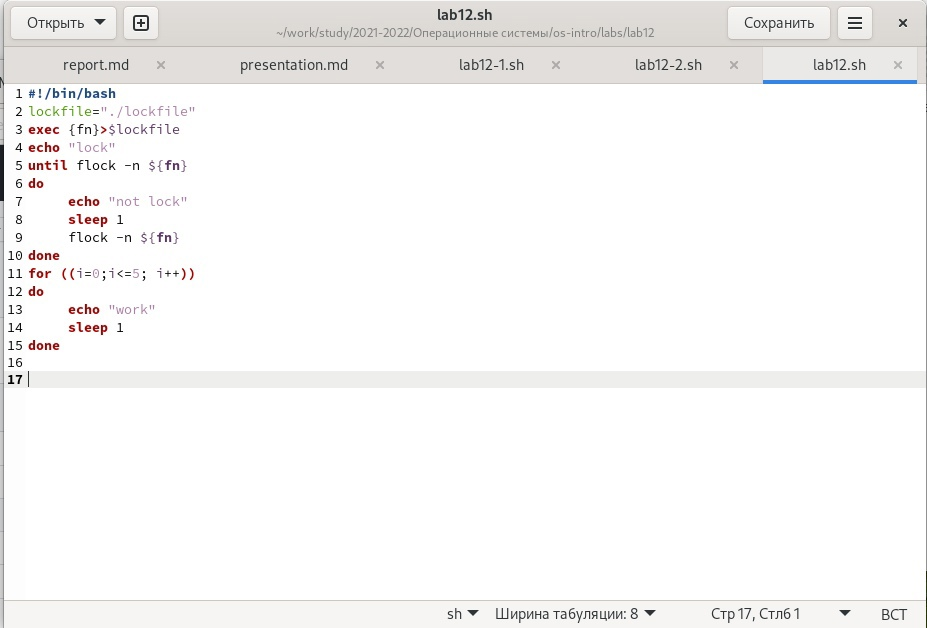
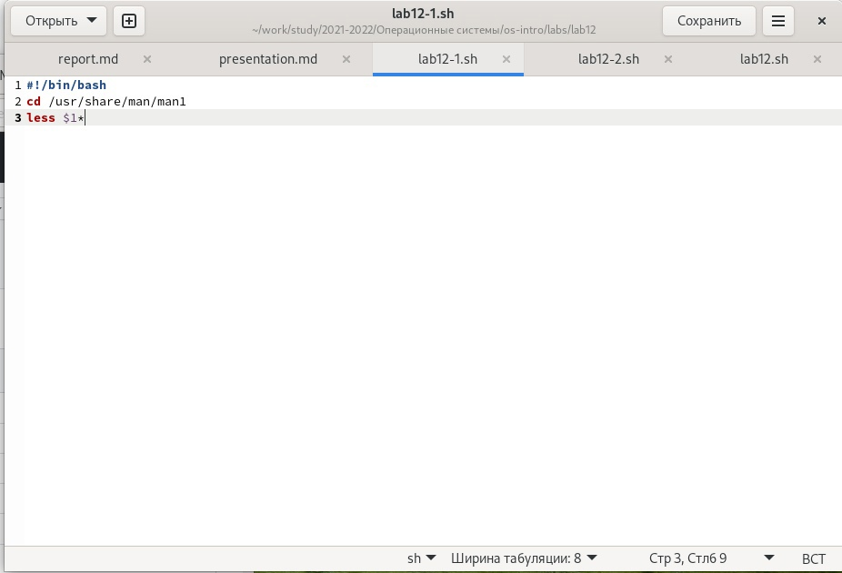
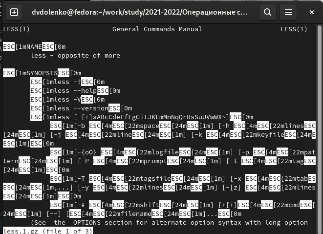
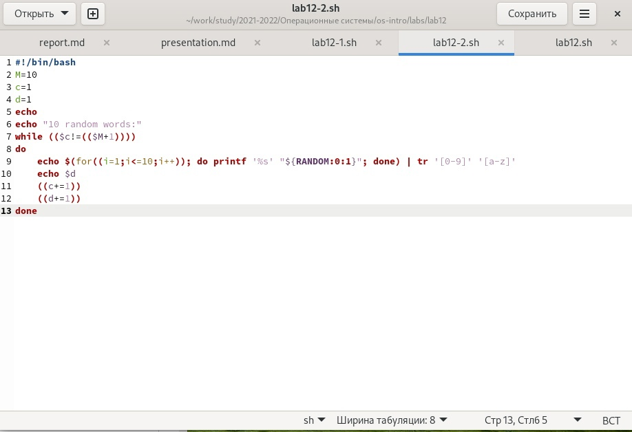
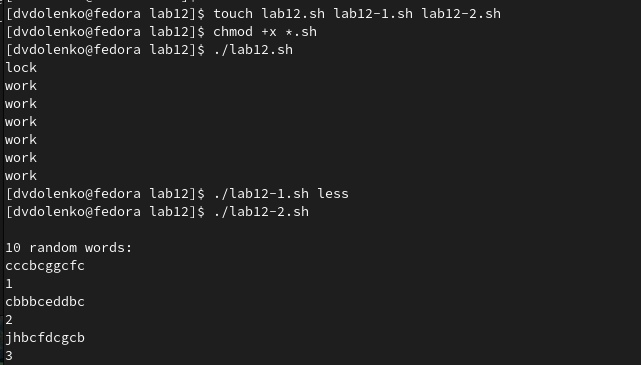

---
## Front matter
title: "Лабораторная работа-13"
subtitle: "Программирование в командном процессоре ОС UNIX. Расширенное программирование"
author: "Доленко Дарья Васильевная НБИбд-01-21"

## Generic otions
lang: ru-RU
toc-title: "Содержание"

## Bibliography
bibliography: bib/cite.bib
csl: pandoc/csl/gost-r-7-0-5-2008-numeric.csl

## Pdf output format
toc: true # Table of contents
toc-depth: 2
lof: true # List of figures
fontsize: 12pt
linestretch: 1.5
papersize: a4
documentclass: scrreprt
## I18n polyglossia
polyglossia-lang:
  name: russian
  options:
	- spelling=modern
	- babelshorthands=true
polyglossia-otherlangs:
  name: english
## I18n babel
babel-lang: russian
babel-otherlangs: english
## Fonts
mainfont: PT Serif
romanfont: PT Serif
sansfont: PT Sans
monofont: PT Mono
mainfontoptions: Ligatures=TeX
romanfontoptions: Ligatures=TeX
sansfontoptions: Ligatures=TeX,Scale=MatchLowercase
monofontoptions: Scale=MatchLowercase,Scale=0.9
## Biblatex
biblatex: true
biblio-style: "gost-numeric"
biblatexoptions:
  - parentracker=true
  - backend=biber
  - hyperref=auto
  - language=auto
  - autolang=other*
  - citestyle=gost-numeric
## Pandoc-crossref LaTeX customization
figureTitle: "Рис."
listingTitle: "Листинг"
lofTitle: "Список иллюстраций"
lolTitle: "Листинги"
## Misc options
indent: true
header-includes:
  - \usepackage{indentfirst}
  - \usepackage{float} # keep figures where there are in the text
  - \floatplacement{figure}{H} # keep figures where there are in the text
---

# Цель работы

Изучить основы программирования в оболочке ОС UNIX. Научится писать более сложные командные файлы с использованиемлогических управляющих конструкций и циклов.

# Выполнение лабораторной работы

Написала командный файл, реализующий упрощённый механизм семафоров. Командный файл должен втечение некоторого времени t1 дожидаться освобождения ресурса,выдавая об этом сообщение,а дождавшись его освобождения,использовать его в течение некоторого времени t2<>t1, также выдавая информацию о том, что
ресурс используется соответствующим командным файлом (процессом).Запустить
командный файл в одном виртуальномтерминале в фоновом режиме,перенаправив
его вывод в другой (> /dev/tty#,где # —номертерминала куда перенаправляется
вывод),в которомтакже запущен этотфайл,но не фоновом,а в привилегированном
режиме.Доработалапрограммутак,чтобыимеласьвозможностьвзаимодействиятрёх
и более процессов. (рис. [-@fig:001])

{#fig:001 width=70%}

Реализовала команду man с помощью командного файла.Изучите содержимое ката-
лога /usr/share/man/man1.В нем находятся архивытекстовых файлов,содержащих
справку по большинству установленных в системе программ и команд.Каждый архив
можнооткрытькомандойless сразужепросмотревсодержимоесправки.Командный
файлдолженполучатьввидеаргументакоманднойстрокиназваниекомандыиввиде
результата выдавать справку об этой команде или сообщение об отсутствии справки,
если соответствующего файла нет в каталоге man1. (рис. [-@fig:002] [-@fig:003])

{#fig:002 width=70%}

{#fig:003 width=70%}

Используя встроенную переменную $RANDOM,написала командный файл,генерирую-
щий случайную последовательность букв латинского алфавита. (рис. [-@fig:004])

{#fig:004 width=70%}

# (рис. [-@fig:005])

{#fig:005 width=70%}

# Вывод
 
В ходе данной лабораторной работы я изучила основы программирования в оболочке ОС UNIX, научилась писать более сложные командные файлы с использованиемлогических управляющих конструкций и циклов.

# Ответы на контрольные вопросы:

1. Команда getopts является встроенной командой командной оболочки bash, предназначенной для разбора параметров сценариев. Она обрабатывает исключительно однобуквенные параметры как с аргументами, так и без них и этого вполне достаточно для передачи сценариям любых входных данных.

2. При генерации имен используют метасимволы:

	произвольная (возможно пустая) последовательность символов;
	? один произвольный символ;
	[...] любой из символов, указанных в скобках перечислением и/или с указанием диапазона;
	cat f* выдаст все файлы каталога, начинающиеся с "f";
	cat f выдаст все файлы, содержащие "f";
	cat program.? выдаст файлы данного каталога с однобуквенными расширениями, скажем "program.c" и "program.o", но не выдаст "program.com";
	cat [a-d]* выдаст файлы, которые начинаются с "a", "b", "c", "d".
	Аналогичный эффект дадут и команды "cat [abcd]" и "cat [bdac]".

3. Операторы && и || являются управляющими операторами. Если в командной строке стоит command1 && command2, то command2 выполняется в том, и только в том случае, если статус выхода из команды command1 равен нулю, что говорит об успешном ее завершении. Аналогично, если командная строка имеет вид command1 || command2, то команда command2 выполняется тогда, и только тогда, когда статус выхода из команды command1 отличен от нуля.

4. Оператор break завершает выполнение ближайшего включающего цикла или условного оператора, в котором он отображается.

5. Команда true всегда возвращает ноль в качестве выходного статуса для индикации успеха. Команда false всегда возвращает не-ноль в качестве выходного статуса для индикации неудачи. Во всех управляющих конструкциях в качестве логического значения используется код возврата из программы, указанной в качестве условия. Код возврата 0 – истина, любое другое значение – ложь. Программа true – всегда завершается с кодом 0, false – всегда завершается с кодом 1.

6. Введенная строка означает условие существования файла man$s/$i.$s

7. Цикл While выполняется до тех пор, пока указанное в нем условие истинно. Когда указанное условие становится ложным - цикл завершается. Цикл Until выполняется до тех пор, пока указанное в нем условие ложно.

