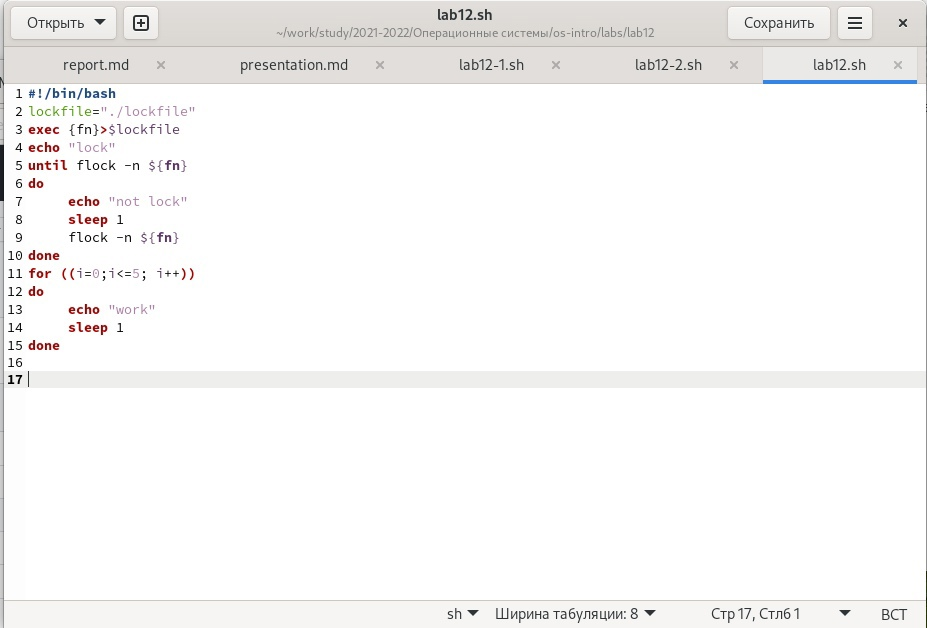
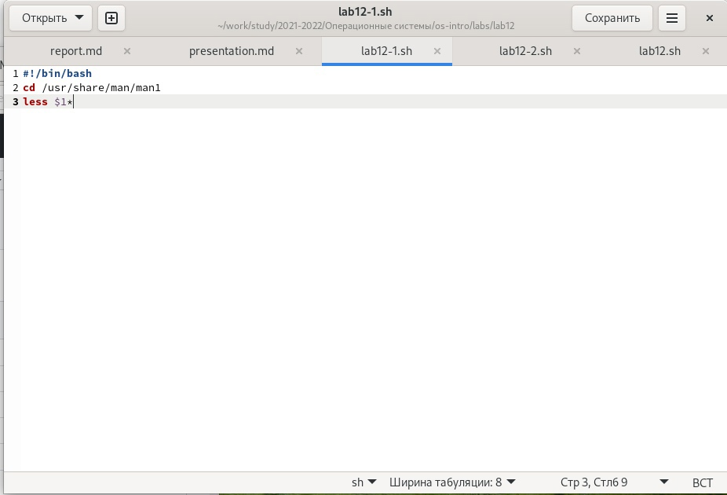
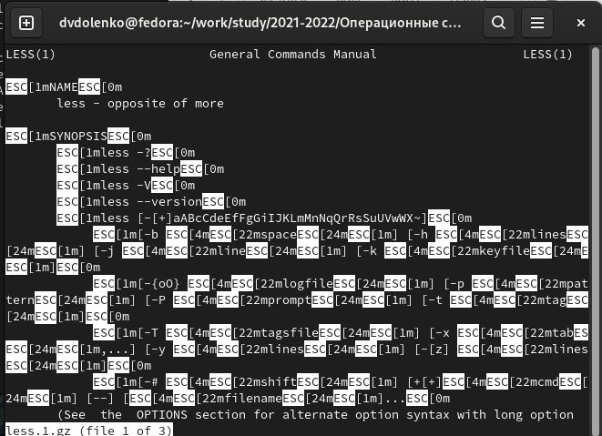
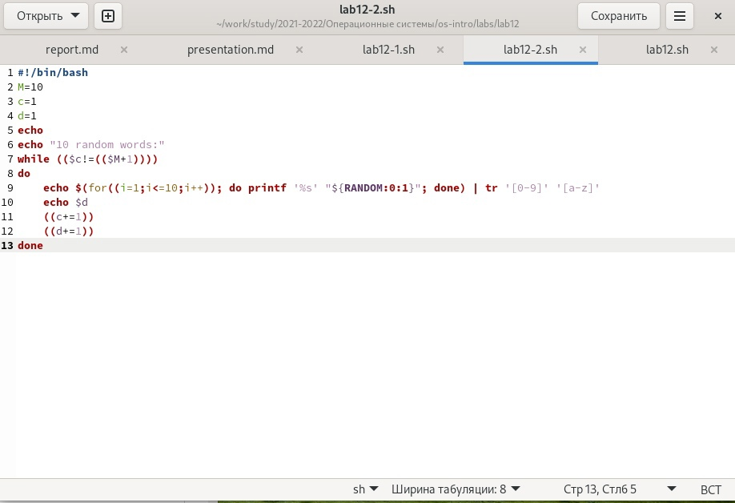
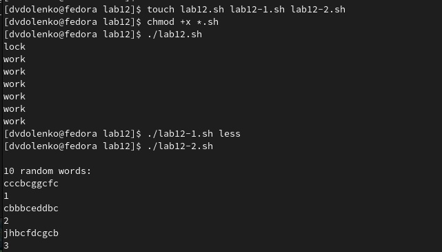

---
## Front matter
lang: ru-RU
title: Программирование в командном процессоре ОС UNIX. Расширенное программирование
author: |
	  Доленко Дарья Васильевна НБИбд-01-21\inst{1}

institute: |
	\inst{1}Российский Университет Дружбы Народов

date: 28 мая, 2022, Москва, Россия

## Formatting
mainfont: PT Serif
romanfont: PT Serif
sansfont: PT Sans
monofont: PT Mono
toc: false
slide_level: 2
theme: metropolis
header-includes: 
 - \metroset{progressbar=frametitle,sectionpage=progressbar,numbering=fraction}
 - '\makeatletter'
 - '\beamer@ignorenonframefalse'
 - '\makeatother'
aspectratio: 43
section-titles: true

---

# Цели и задачи работы

## Цель лабораторной работы

Изучить основы программирования в оболочке ОС UNIX. Научится писать более сложные командные файлы с использованиемлогических управляющих конструкций и циклов.

# Процесс выполнения лабораторной работы

## Написала командный файл, реализующий упрощённый механизм семафоров.  (рис. [-@fig:001])

{#fig:001 width=70%}

## Реализовала команду man с помощью командного файла. (рис. [-@fig:002] [-@fig:003])

{#fig:002 width=70%}

##

{#fig:003 width=70%}

## Используя встроенную переменную $RANDOM,написала командный файл,генерирую-
щий случайную последовательность букв латинского алфавита. (рис. [-@fig:004])

{#fig:004 width=70%}

## (рис. [-@fig:005])

{#fig:005 width=70%}

# Выводы по проделанной работе

## Вывод

В ходе данной лабораторной работы я изучила основы программирования в оболочке ОС UNIX, научилась писать более сложные командные файлы с использованиемлогических управляющих конструкций и циклов.
